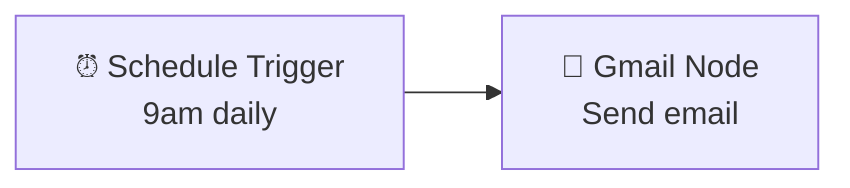
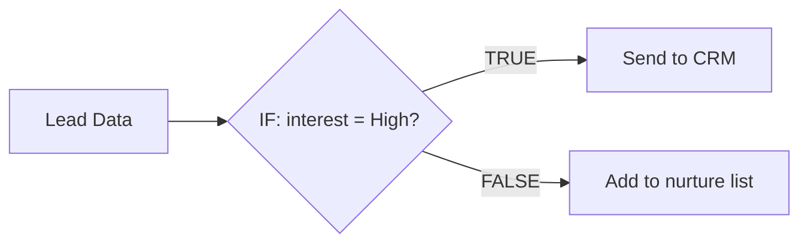

# n8n Day 1 — Introduction, Setup & Core Fundamentals
**Date:** 08 September 2026  
**Course:** n8n Masterclass: Build AI Automations & Scalable Workflows (Udemy)  
**Sections covered:** Section 1 (complete ✅) + Section 2 (lessons 2.7–2.8 ✅)  
**Time spent:** ~90 minutes

---

## 🧠 Why n8n? The Big Picture

n8n is a visual, drag-and-drop workflow automation tool that connects apps, APIs, and AI together — without writing complex code. Think of it as the glue between your tools.

**As a Cloud + AI Automation Consultant**, n8n lets you build systems that:
- Automatically send emails, update spreadsheets, and post social content
- Pull data from APIs and route it through AI models
- Save clients 5+ hours per week with a single workflow

**Real SME examples you'll build in this course:**
- LinkedIn content system (generates a week of posts in 15 minutes)
- SEO content engine (automated keyword research + article generation)
- Custom AI dashboards with front-ends for clients

---

## ⚙️ Setting Up n8n Cloud

### Cloud vs Self-Hosted

| Option | Cost | Setup | Best For |
|--------|------|-------|----------|
| **n8n Cloud** | ~£24/month (2,500 executions, 5 workflows) | 2 minutes | Learning, client demos |
| **Self-hosted** | ~£15–20/month (unlimited) | 30+ minutes | Production, scaling |

For this course → **use n8n Cloud**. No maintenance, automatic updates, built-in backups.

### Steps to Set Up

1. Go to **n8n.io** → Pricing → Starter Plan → Start Free Trial
2. Create your account and give it a name (e.g. `yourname-cloud`)
3. Activate via email
4. Log in → you land on your **workflow canvas**
5. *(Optional)* Go to Settings → Personalization → switch to Light Theme

> 💡 You get **14 days free** and **1,000 executions** on trial — more than enough for this entire course.

---

## 🔑 Core Concepts: Workflows, Triggers & Nodes

These three concepts are the foundation of everything in n8n.

### What is a Workflow?
A workflow is a set of automated instructions that connects multiple apps together.

```
Example:
Every day at 9am → Send me an email saying "Have a great day, today is [date]"
```



### What is a Trigger?
A trigger is the **starting point** of every workflow — it listens for an event and fires the workflow when that event occurs.

| Trigger Type | When It Fires | Example |
|-------------|--------------|---------|
| **Manual Trigger** | When you click "Execute" | Testing during development |
| **Schedule Trigger** | At a set time/interval | Daily report at 9am |
| **Webhook** | When another system sends data | Form submission fires workflow |
| **App Event** | When something happens in an app | New row added to Google Sheet |

> 💡 **Every workflow must start with a trigger.** No trigger = workflow can never run automatically.

### What is a Node?
A node is a **single step** in your workflow. Each node does one thing — connects to an app, transforms data, or makes a decision.

```
Trigger → Node 1 → Node 2 → Node 3 → Output
```

Nodes flow **left to right** on the canvas.

---

## 🏗️ Project 1: Email Sender — Your First Workflow

### What it does
Sends you an automatic email every day at 9am with today's date in the message.

### Step-by-Step Build

**Step 1: Create a new workflow**
- Click "New Workflow" → name it `Email Sender - First Workflow`

**Step 2: Add a Manual Trigger (for testing)**
- Open Nodes panel (Tab key) → search "Manual Trigger" → add it to canvas

**Step 3: Add a Gmail Node**
- Tab → "Take action in an app" → search Gmail → select "Send a Message"
- Fill in:
  - **Send To:** your email address
  - **Subject:** Hello [your name]
  - **Message:** Hey this is a test email

**Step 4: Connect Gmail to Google Account via OAuth2**
- Click "Create new credential" → "Sign in with Google"
- OAuth2 = the "Sign in with Google" button you see on websites — secure, no password stored
- ⚠️ **Important:** Rename the credential to something memorable (e.g. `Gmail - Hasan`) — you may add multiple accounts later

**Step 5: Execute and test**
- Click "Execute Workflow" — nodes light up green when successful
- Check your inbox — you'll see the test email

**Step 6: Remove n8n branding**
- In Gmail node → Options → turn off "Append n8n Attribution"

**Step 7: Add a Schedule Trigger**
- Tab → search "Schedule Trigger" → set to **every day at 9:00am**
- Connect Schedule Trigger → Gmail node
- Now the workflow has TWO triggers (manual for testing + scheduled for production)

**Step 8: Add a dynamic date expression**
- In the message field → switch to **Expression** mode
- Type: `Have a great day, today is {{ $now.format('dd-LLL-yyyy') }}`
- `{{ }}` = expression syntax in n8n — makes values dynamic
- `$now` = current date/time
- `.format('dd-LLL-yyyy')` = formats as "08-Sep-2026"

**Step 9: Activate the workflow**
- Toggle "Active" (top right) → workflow will now run every day at 9am automatically
- ✅ Check the Executions tab to see run history — inputs, transformations, outputs

### Workflow JSON (import directly into n8n)

```json
{
  "name": "Email Sender - First Workflow",
  "nodes": [
    {
      "parameters": {},
      "type": "n8n-nodes-base.manualTrigger",
      "typeVersion": 1,
      "position": [0, 0],
      "name": "When clicking 'Execute workflow'"
    },
    {
      "parameters": {
        "sendTo": "your_email",
        "subject": "Hello",
        "emailType": "text",
        "message": "=Have a great day, today is {{ $now.format('dd-LLL-yyyy') }}",
        "options": { "appendAttribution": false }
      },
      "type": "n8n-nodes-base.gmail",
      "typeVersion": 2.1,
      "position": [224, 0],
      "name": "Send an email"
    },
    {
      "parameters": {
        "rule": { "interval": [{ "triggerAtHour": 9 }] }
      },
      "type": "n8n-nodes-base.scheduleTrigger",
      "typeVersion": 1.2,
      "position": [0, -144],
      "name": "Schedule Trigger"
    }
  ],
  "connections": {
    "When clicking 'Execute workflow'": {
      "main": [[{ "node": "Send an email", "type": "main", "index": 0 }]]
    },
    "Schedule Trigger": {
      "main": [[{ "node": "Send an email", "type": "main", "index": 0 }]]
    }
  },
  "active": false
}
```

> 📥 To import: In n8n → New Workflow → top-right menu (···) → Import from JSON → paste above

---

## 📊 Section 2: The 80/20 Rule — 13 Nodes That Cover Everything

The instructor has built 150+ automations for clients using only **13 core nodes**. Master these and you can build almost anything.

### The 5 Categories

```
┌─────────────────────────────────────────────────────────────┐
│              13 NODES — THE n8n 80/20                       │
├──────────────────┬──────────────────────────────────────────┤
│ 1. TRIGGER NODES │ Manual, Schedule/Cron, Webhook           │
│ 2. DATA PROCESS  │ Split Out, Aggregate, Set, IF, Code      │
│ 3. CONNECTIVITY  │ HTTP Request, Webhook Response           │
│ 4. STORAGE       │ Google Sheets, Database (Airtable etc)   │
│ 5. AI            │ Basic LLM Chain, AI Agent                │
└──────────────────┴──────────────────────────────────────────┘
```

### Category 1: Trigger Nodes
| Node | What it does | When to use |
|------|-------------|-------------|
| **Manual Trigger** | Fires when you click Execute | Testing and development |
| **Schedule Trigger** | Fires on a time schedule | Daily reports, weekly checks |
| **Webhook** | Fires when another system POSTs data | Form submissions, Stripe events |

### Category 2: Data Processing (the core 5)
| Node | What it does |
|------|-------------|
| **Split Out** | Flattens an array into individual items (1 array of 5 → 5 separate items) |
| **Aggregate** | Merges individual items back into an array (opposite of Split Out) |
| **Set (Edit Fields)** | Creates and modifies data fields — most used node in n8n |
| **IF** | Branches workflow based on a condition (true path / false path) |
| **Code** | Run custom JavaScript for complex transformations |

### Category 3: Connectivity & APIs
| Node | What it does |
|------|-------------|
| **HTTP Request** | Calls any external API (GET, POST, with authentication) |
| **Webhook Response** | Sends data back to the system that triggered the webhook |

> 💡 **HTTP Request** = the most powerful node. If an app has an API, you can connect to it — even if n8n has no built-in integration.

### Category 4: Storage
| Node | What it does |
|------|-------------|
| **Google Sheets** | Lightweight database — read/write rows, perfect for client reporting |
| **Database nodes** | Connect to Airtable, Notion, MySQL etc for structured data |

### Category 5: AI Integration
| Node | When to use |
|------|------------|
| **Basic LLM Chain** | When you need AI to make a judgement call (sentiment, classification, summarisation) |
| **AI Agent** | When the AI needs tools, memory, or to make decisions across multiple steps |

> 🧠 **Key insight:** Use traditional IF nodes for deterministic logic ("if invoice > £1000, send for approval"). Use AI when the logic requires judgement ("if customer email suggests they might cancel, flag for retention").

---

## ⚡ Execution Essentials — How n8n Runs Workflows

### Rule 1: Left to Right, Top to Bottom
Workflows execute left to right. If a trigger connects to two branches, the **top branch always runs first**.

```
[Trigger] → [Node A] → [Node B]
                ↓
            [Node C]   ← runs AFTER Node B completes
```

### Rule 2: Sequential Execution (not parallel)
By default, n8n runs nodes **one after another** (synchronously). Node B doesn't start until Node A finishes.

### Rule 3: Nodes Run Once Per Input
If 5 items enter a node, the node runs 5 times — once for each item.

```
[5 lead records] → [IF node] → runs 5 times → 3 go TRUE path, 2 go FALSE path
```

### Rule 4: Branching with IF
The IF node splits your workflow into two paths:
- **True path** → condition matched
- **False path** → condition did not match



### Rule 5: Active Toggle
- **Inactive** = workflow only runs when you manually click Execute (testing mode)
- **Active** = workflow runs automatically based on its trigger (production mode)
- You can only activate a workflow if it has an external trigger (Webhook or Schedule)

---

## 💼 Business Value for SME Clients

| Workflow | Client Problem Solved | Time Saved |
|---------|----------------------|-----------|
| Email Sender (today's build) | Automated daily briefings to staff | 5 min/day |
| Schedule + API + Sheets | Auto-pull sales data into reporting sheet | 2 hrs/week |
| Webhook + IF + Gmail | Route customer enquiries to right team member | Instant vs manual |
| LLM Chain + Gmail | Classify and respond to support emails with AI | 4 hrs/week |

---

## 📝 Key Commands & Expressions

```javascript
// Dynamic date in message field
{{ $now.format('dd-LLL-yyyy') }}       // → "08-Sep-2026"
{{ $now.format('DD/MM/YYYY') }}        // → "08/09/2026"

// Reference data from a previous node
{{ $json.firstName }}                   // get field from current item
{{ $('NodeName').item.json.fieldName }} // get field from specific node

// JavaScript in Code node
for (const item of $input.all()) {
  item.json['full_name'] = item.json.firstName + ' ' + item.json.lastName;
}
return $input.all();
```

---

## ✅ What I Built Today

- [x] n8n Cloud account set up
- [x] First workflow: Email Sender with Schedule Trigger + dynamic date expression
- [x] Understood the 13 core nodes and their 5 categories
- [x] Learned execution rules (sequential, per-item, branching)

## ➡️ What's Next

- Section 2 (remaining): HTTP Request deep dive, Webhook patterns, Google Sheets integration
- Section 3: Workflow planning + AI fundamentals
- Section 4: **LinkedIn Content Automation System** (the first real client-ready project)

---

*Study log: github.com/SadainHasan/cloud-ai-portfolio | n8n Masterclass — Udemy*
