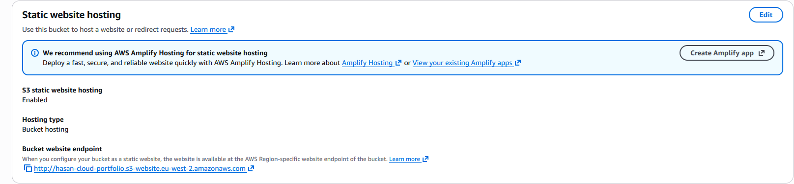
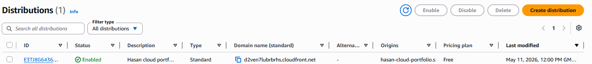
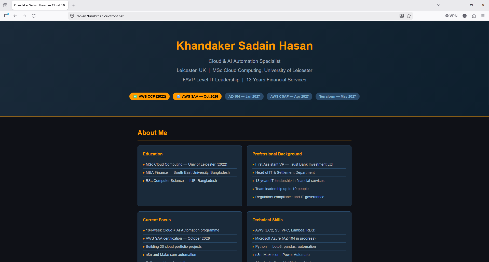

# Project 01 — Cloud Portfolio Website

**Author:** Khandaker Sadain Hasan  
**Location:** Leicester, UK  
**Date started:** 01 May 2026  
**Status:** ✅ Live — https://d2ven7lubrbrhs.cloudfront.net

---

## About Me

I am a cloud and AI automation professional based in Leicester, UK,
returning to senior technology after 13 years of IT leadership in 
the financial services sector in Bangladesh.

**Education**
- MSc Cloud Computing — University of Leicester (2020–2022)
- MBA Finance — South East University, Bangladesh (2010–2011)
- BSc Computer Science — Independent University, Bangladesh (2001–2005)

**Professional Background**
- First Assistant Vice President and Head of IT & Settlement Department
  at Trust Bank Investment Ltd, Bangladesh (2016–2019)
- Led IT strategy, regulatory compliance, and a team of up to 10
- 13 years total IT leadership in banking and financial services
- Managed network infrastructure, software migrations, and vendor 
  negotiations at executive level

**Current**
- Executing a 24-month Cloud + AI Automation Specialist programme
- Targeting AWS CSAP, AZ-104, and Terraform Associate certifications
- Building a portfolio of 20 cloud and AI automation projects

---

## Certifications in Progress

| Certification | Provider | Target Date | Status |
|---|---|---|---|
| AWS Cloud Practitioner (CLF-C02) | Amazon Web Services | January 2022 | ✅ Certified (expired Jan 2025) |
| AWS Solutions Architect Associate (SAA-C03) | Amazon Web Services | October 2026 | 🔄 In progress |
| Microsoft Azure Administrator (AZ-104) | Microsoft | January 2027 | 📅 Planned |
| AWS Solutions Architect Professional (CSAP) | Amazon Web Services | April 2027 | 📅 Planned |
| HashiCorp Terraform Associate | HashiCorp | May 2027 | 📅 Planned |

---

## Project Overview

A professional cloud portfolio website hosted entirely on AWS using 
S3 for static file storage and CloudFront as a global CDN.

No web servers. No maintenance. Estimated cost approximately £1 per month.

---

## Planned Architecture
[User] → [Route 53 DNS] → [CloudFront CDN] → [S3 Bucket]
↑
[ACM SSL Certificate]
(free HTTPS via AWS)

---

## AWS Services Planned

| Service | Purpose |
|---|---|
| Amazon S3 | Static website hosting — stores HTML, CSS, images |
| Amazon CloudFront | Global CDN — caches content at 450+ edge locations |
| Amazon Route 53 | DNS management — routes domain to CloudFront |
| AWS Certificate Manager | Free SSL/TLS certificate for HTTPS |
| Origin Access Control | Restricts S3 access to CloudFront only |

---

## Steps

- [x] Create S3 bucket and enable static website hosting
- [x] Upload index.html portfolio page
- [x] Create CloudFront distribution pointing to S3
- [ ] Configure Origin Access Control (OAC) to secure S3
- [x] Verify HTTPS working via CloudFront URL
- [ ] Connect custom domain via Route 53
- [ ] Add AWS Certificate Manager SSL for custom domain

---
## What Problem Does This Solve?

Traditional website hosting requires a web server running 
24/7 at £10-15/month, manual SSL certificate renewal every 
year, and serves content from a single location.

This S3 + CloudFront architecture eliminates all of that.
No server to manage. SSL auto-renewed by AWS. Content served 
from the nearest of 450+ global edge locations. Total cost: 
approximately $0.11/month — a 99% cost reduction vs 
traditional hosting with better performance and reliability.

---

## Why This Architecture?

Traditional hosting: pay £10-15/month for a shared server, 
single location, no global caching, manual SSL renewal.

This architecture:
- **Cost:** approximately £1/month (S3 + CloudFront)
- **Performance:** content served from nearest edge location globally
- **Security:** S3 bucket not publicly accessible — only CloudFront can read it
- **Reliability:** CloudFront has 99.99% SLA
- **SSL:** free and auto-renewed via AWS Certificate Manager

---

## Screenshots

### S3 Static Website Hosting

### CloudFront Distribution

### Live Portfolio Site

---

## Planned Cost Breakdown

| Service | Estimated Monthly Cost |
|---|---|
| S3 storage (under 1GB) | ~$0.02 |
| CloudFront (under 1GB transfer) | ~$0.09 |
| Route 53 hosted zone | $0.50 |
| ACM certificate | FREE |
| **Total** | **~$0.61/month** |

---

## Exam Relevance (AWS SAA-C03)

This project covers the following SAA exam topics:

- S3 static website hosting and bucket policies
- CloudFront distributions and Origin Access Control
- Route 53 DNS and Alias records
- AWS Certificate Manager and SSL/TLS
- Content Delivery Network architecture patterns

---

*Part of a 24-month Cloud + AI Automation Specialist plan*  
*MSc Cloud Computing, University of Leicester*  
*AWS CCP certified January 2022 | AWS SAA target: October 2026*
