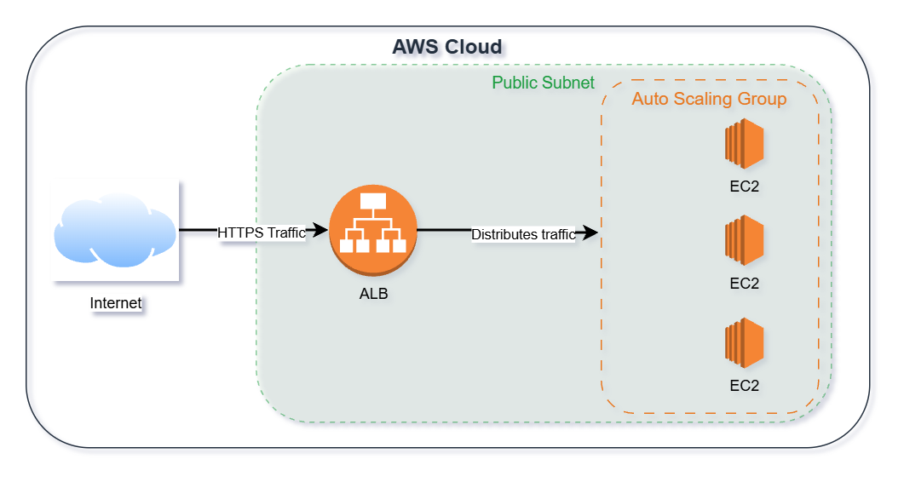

# Project 02 — EC2 Auto-Scaling Web Server

**Author:** Khandaker Sadain Hasan
**Date started:** 03 May 2026
**Status:** 🔄 In progress

---

## What is EC2?

Amazon EC2 (Elastic Compute Cloud) is AWS's virtual server service 
that lets you launch resizable computing capacity in the cloud — 
eliminating the need to invest in physical hardware upfront.

## What I did today

I launched my first EC2 instance (t2.micro, Amazon Linux 2023) 
on AWS using the free tier, configured a key pair for secure 
access, and successfully connected to the server using EC2 
Instance Connect directly in the browser.

---

## Architecture

### Flow explanation

| Step | What happens |
|---|---|
| 1 | User request arrives from the internet |
| 2 | Application Load Balancer receives the request on port 443 (HTTPS) |
| 3 | ALB checks health of all registered EC2 instances |
| 4 | ALB routes request to a healthy EC2 instance |
| 5 | EC2 instance processes the request and returns a response |
| 6 | If traffic increases, Auto Scaling Group launches new EC2 instances automatically |
| 7 | If traffic decreases, Auto Scaling Group terminates excess instances |

## What Problem Does This Solve?

Fixed-capacity servers waste money during low traffic and 
fail under high demand. A bank sizing its trading platform 
for peak load pays for idle capacity 23 hours a day.

An Auto Scaling Group with an Application Load Balancer 
solves both simultaneously. The ASG adds EC2 instances 
automatically when traffic increases and removes them when 
it drops. The ALB stops sending traffic to any failed 
instance immediately. Result: handles any traffic volume, 
costs scale with actual usage, zero downtime on failure.

### Why this architecture?

- **High availability:** ALB distributes traffic across multiple EC2 instances
- **Fault tolerant:** if one EC2 instance fails, ALB stops sending it traffic
- **Auto scaling:** ASG launches new instances when CPU exceeds target threshold
- **Cost efficient:** ASG terminates instances when traffic drops — pay only for what you use

---

## AWS Services Used

| Service | Purpose |
|---|---|
| Amazon EC2 | Virtual server (t3.micro, Amazon Linux 2023) |
| Amazon EBS | 8GB root volume attached to the instance |
| EC2 Key Pair | Secure SSH access credential |
| Auto Scaling Group | Will be added in next steps |
| Application Load Balancer | Will be added in next steps |

---

## Steps Completed

- [x] Launched EC2 instance (t3.micro, free tier)
- [x] Created key pair (my-keypair.pem)
- [x] Connected via EC2 Instance Connect
- [x] Verified instance running (2/2 status checks passed)
- [x] Create AMI from instance (my-first-ami — 06 May 2026)
- [ ] Set up Auto Scaling Group
- [ ] Attach Application Load Balancer

---

## Screenshot

---

## Key Things I Learned

- Stop vs Terminate: Stop preserves the EBS volume, Terminate deletes it
- AMI = Amazon Machine Image — the template used to launch the instance
- t2.micro is free tier eligible for 750 hours/month for 12 months
- EBS = the hard drive attached to my EC2 instance (8GB by default)

---

*Part of a 24-month Cloud + AI Automation Specialist plan*
*AWS CCP certified January 2022 | AWS SAA target: October 2026*
