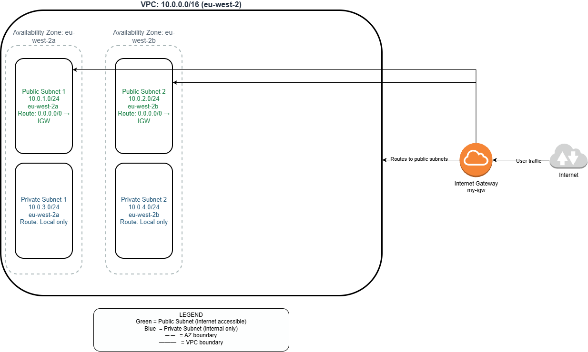
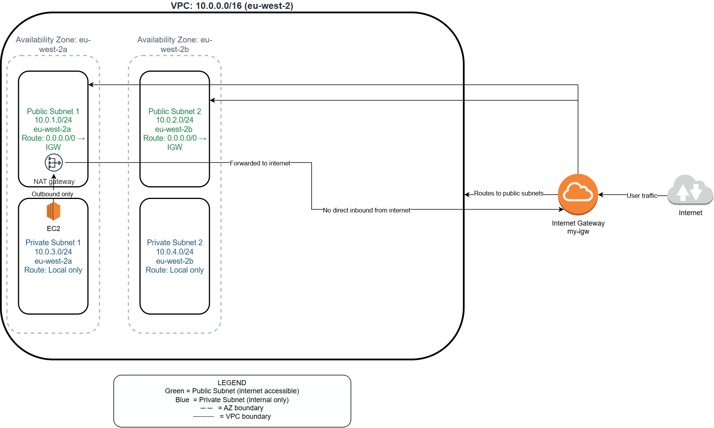
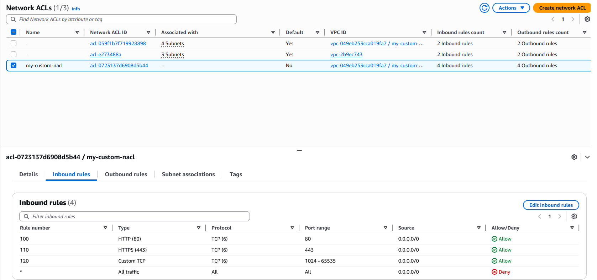
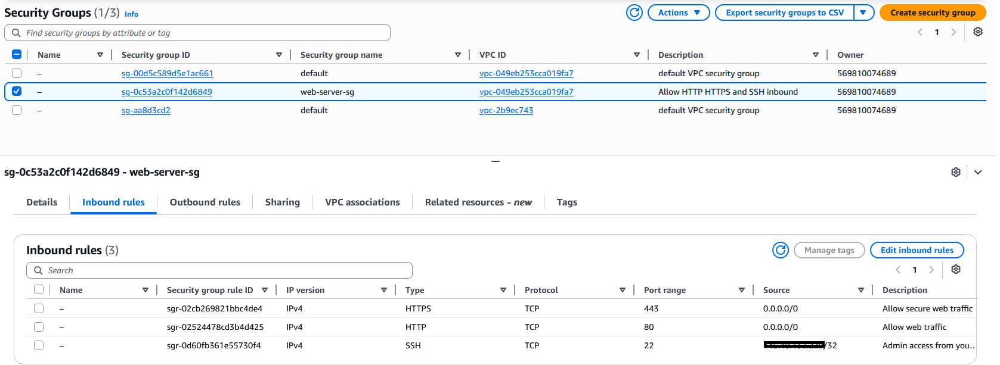
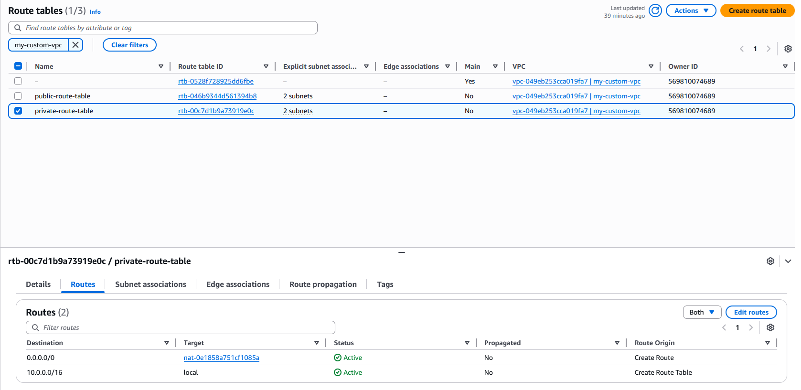
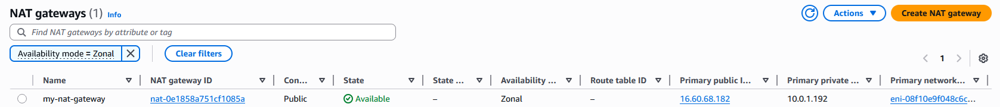

# Project 03 — Custom VPC Network

**Author:** Khandaker Sadain Hasan  
**Date started:** 08 May 2026  
**Status:** 🔄 In progress

---

## What Problem Does This Solve?

The default AWS VPC has all subnets public — unsuitable 
for production workloads. A custom VPC provides:
- Isolated network environment
- Separate public and private tiers
- Fine-grained security controls
- Multi-AZ high availability

---

## Architecture

Updated with NAT Gateway

Updated with NACL rules

Updated with Security group

Updated with Private route table

Updated with NAT gateway

### Components

| Component | Name | CIDR / Details |
|---|---|---|
| VPC | my-custom-vpc | 10.0.0.0/16 |
| Public Subnet 1 | public-subnet-1 | 10.0.1.0/24 — eu-west-2a |
| Public Subnet 2 | public-subnet-2 | 10.0.2.0/24 — eu-west-2b |
| Private Subnet 1 | private-subnet-1 | 10.0.3.0/24 — eu-west-2a |
| Private Subnet 2 | private-subnet-2 | 10.0.4.0/24 — eu-west-2b |
| Internet Gateway | my-igw | Attached to my-custom-vpc |
| Public Route Table | public-route-table | 0.0.0.0/0 → my-igw |

---

## Steps Completed

- [x] Created custom VPC (10.0.0.0/16)
- [x] Created 2 public subnets across 2 AZs
- [x] Created 2 private subnets across 2 AZs
- [x] Created and attached Internet Gateway
- [x] Created public route table with internet route
- [x] Associated public subnets with public route table
- [x] Created NAT Gateway in public-subnet-1
- [x] Updated private route table: 0.0.0.0/0 → NAT Gateway
- [x] Created Security Group: web-server-sg (HTTP/HTTPS/SSH)
- [x] Created custom NACL with inbound and outbound rules
- [x] Architecture diagram updated to v2 with NAT Gateway
- [x] NAT Gateway DELETED after learning session ✅
- [ ] Launch EC2 to test connectivity end to end
- [ ] Add VPC Flow Logs

---

## Key Things Learned

- VPC = isolated private network. Like a bank's internal network.
- Public subnet = has route to IGW. Private subnet = local only.
- AWS reserves 5 IPs per subnet — /24 = 251 usable addresses
- One Internet Gateway per VPC maximum
- Route tables control where traffic goes — must associate with subnets
- Private subnets are NOT the same as no internet — they can get 
  outbound access via NAT Gateway (coming next session)
- This project could have used the newer **Regional NAT Gateway** instead 
  of the traditional Zonal approach.
---

## Exam Relevance — AWS SAA-C03

| Topic | Covered |
|---|---|
| VPC CIDR blocks | ✅ 10.0.0.0/16 range |
| Public vs private subnets | ✅ Both created |
| Internet Gateway | ✅ Created and attached |
| Route tables | ✅ Public route table with IGW route |
| Multi-AZ design | ✅ Subnets across eu-west-2a and eu-west-2b |

---

## Cost

All VPC components are FREE:
- VPC: $0
- Subnets: $0
- Internet Gateway: $0
- Route Tables: $0

⚠️ NAT Gateway (coming next session): $0.045/hour
Delete immediately after learning task.

---

*Part of a 24-month Cloud + AI Automation Specialist plan*  
*MSc Cloud Computing, University of Leicester*
