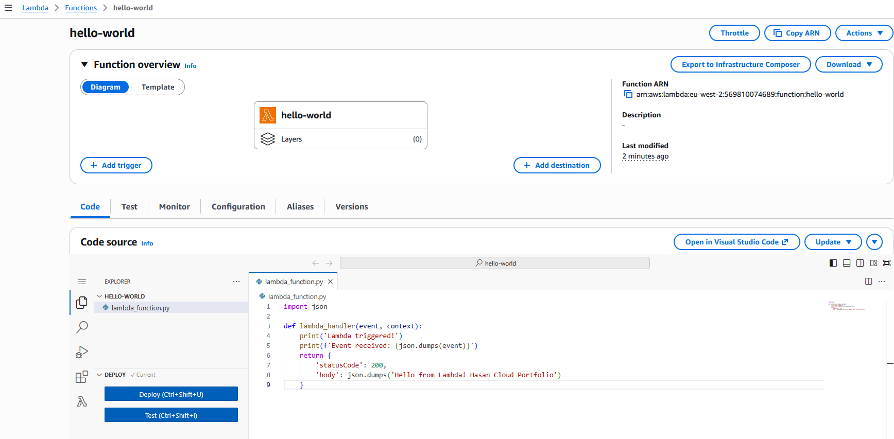
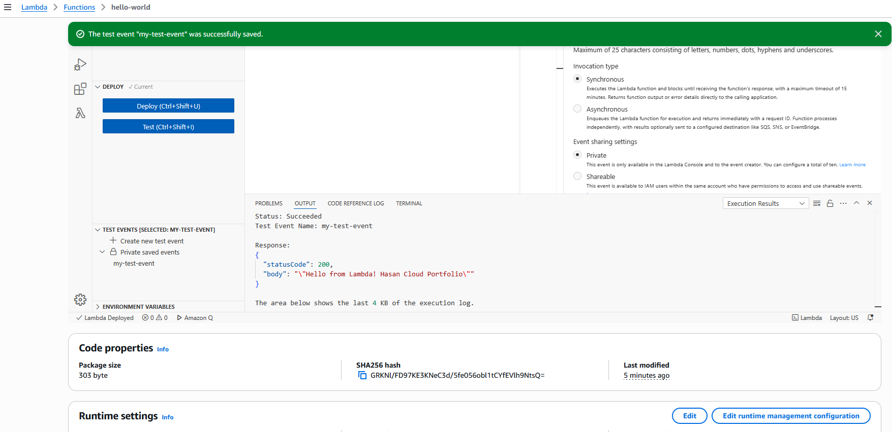
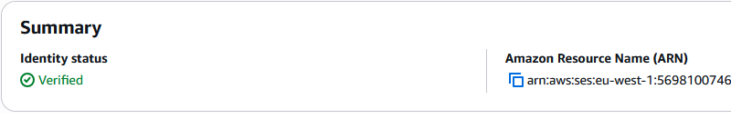
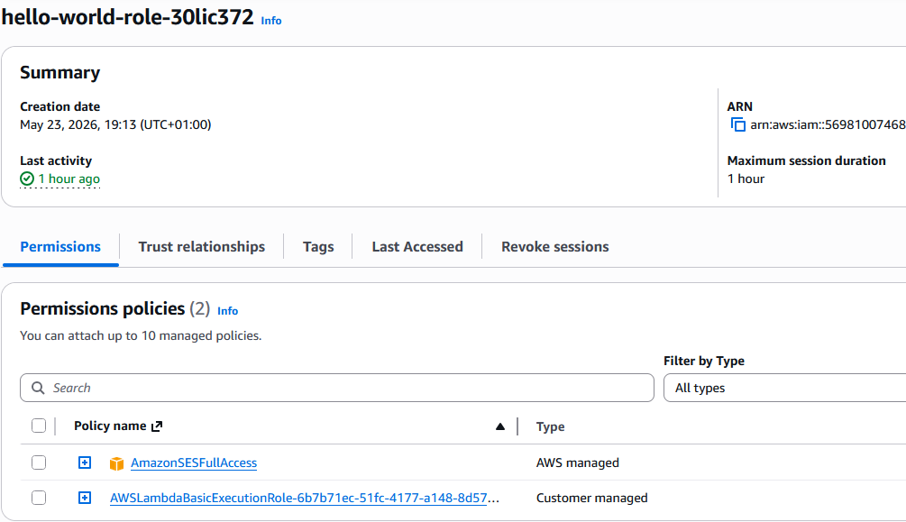
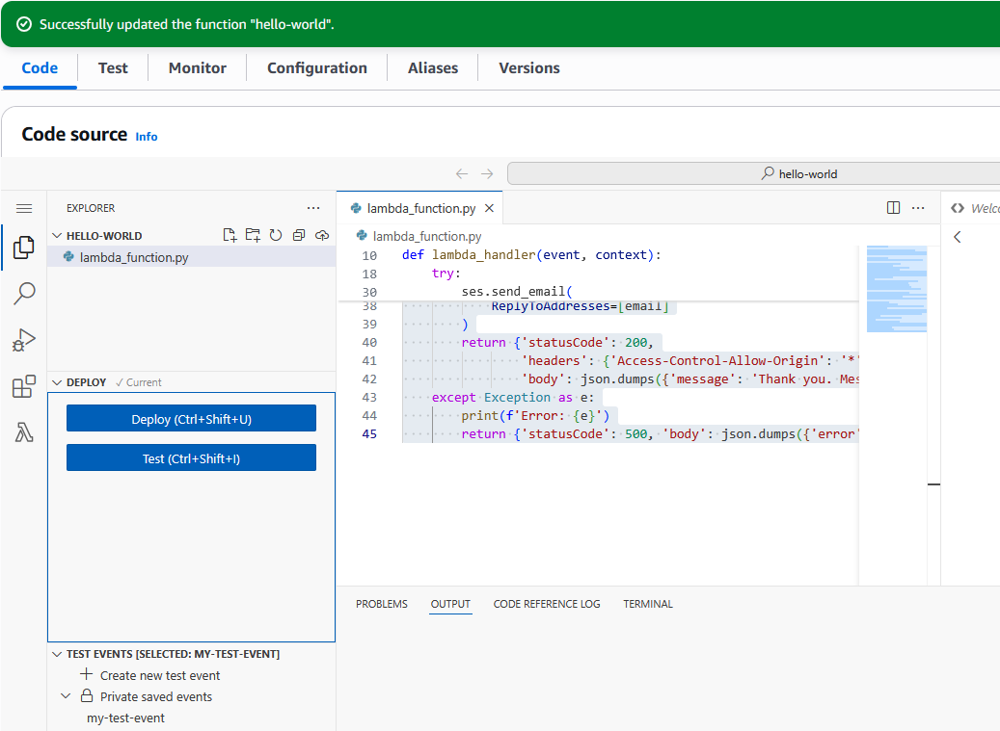
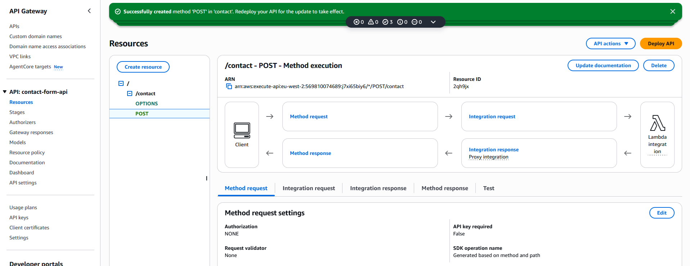
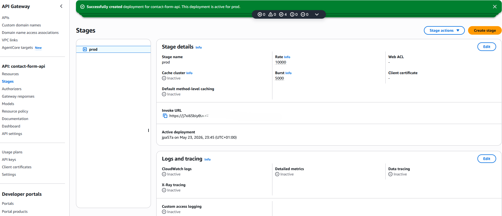
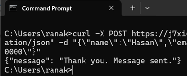
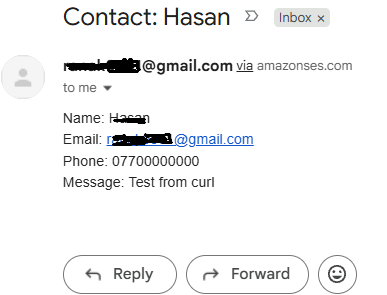
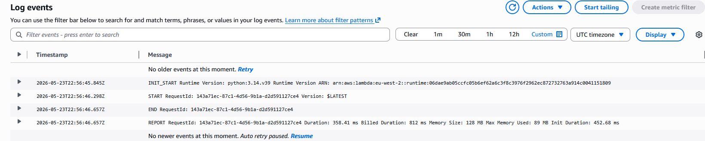

# Project 04 — Serverless Contact Form
## API Gateway + AWS Lambda + Amazon SES

**Status:** Complete | **Region:** eu-west-2 (London) | **Deploy date:** 21 May 2026
**GitHub:** https://github.com/SadainHasan/cloud-ai-portfolio/tree/main/project-04-serverless-contact-form

---

## 1. What Problem Does This Solve?

Every small business in the UK has a contact form on its website. Most are handled
with a £25-50/month SaaS tool (Typeform, JotForm) or a PHP script on shared hosting
that breaks without warning. Both have real costs.

This project eliminates both problems. Lambda runs only when a form is submitted.
Zero submissions = zero cost. For a typical SME receiving 10,000 contact form
submissions per month, the entire infrastructure runs for approximately £0.003/month.

Business owner perspective: you deploy once and your contact form works forever.
No servers to patch. No hosting bills. No downtime. Every submission lands in
your inbox within 2-5 seconds.

---

## 2. What This Is

A fully serverless contact form processing pipeline on three AWS services:

- **API Gateway** — receives HTTPS POST from the website contact form
- **AWS Lambda** — validates data and triggers the email
- **Amazon SES** — delivers the formatted email to the business owner

No servers. Scales from 1 to 10,000 submissions/day automatically.
Cost: under £0.005/month for typical SME usage.

---

## 3. Architecture

```
Website Contact Form
       |
       | HTTPS POST /contact (JSON body: name, email, message, phone)
       v
API Gateway (REST API, Regional, eu-west-2)
  Resource: /contact  |  Method: POST  |  Stage: prod
  Lambda Proxy Integration — passes full HTTP request
       |
       | Event object (JSON)
       v
AWS Lambda (Python 3.12, eu-west-2)
  Function: contact-form-handler
  Memory: 128MB  |  Timeout: 10s
  Execution role: + ses:SendEmail
  Validates input, handles CORS, calls SES
       |
       | boto3 ses.send_email()
       v
Amazon SES (eu-west-1)
  Verified sender identity
  Delivers formatted email < 5 seconds
       |
       v
Business Owner Inbox
```

---

## 4. Build Steps

### Step 1 — Verify Email in SES
1. Console → SES (eu-west-1) → Verified identities → Create identity
2. Identity type: Email address → enter business email → Create
3. Click verification link in the AWS email received
4. Status: Verified (green)

### Step 2 — Update Lambda Execution Role
1. IAM → Roles → find Lambda role (hello-world-role-{id})
2. Add permissions → Attach policies → AmazonSESFullAccess

### Step 3 — Deploy Lambda Code
1. Lambda → hello-world → Code source
2. Replace all code with contact-form-handler (see lambda_function.py)
3. Update RECIPIENT_EMAIL and SENDER_EMAIL to your verified address
4. Click Deploy | Set timeout to 10 seconds

### Step 4 — Create API Gateway
1. API Gateway → Create API → REST API → Build
2. API name: contact-form-api | Endpoint type: Regional
3. Create Resource: /contact (Enable CORS)
4. Create Method: POST → Lambda Proxy Integration → your function
5. Deploy: Actions → Deploy API → New Stage → prod
6. Copy Invoke URL

### Step 5 — Test
curl -X POST https://{invoke-url}/contact \
  -H 'Content-Type: application/json' \
  -d '{"name":"Test","email":"verified@email.com","message":"Hello","phone":"07700000000"}'

Expected: {"message": "Thank you. Message sent."}
Check inbox — email arrives within 2-5 seconds.

---

## 5. Why This Architecture?

**Why Lambda not EC2?**
A contact form receives intermittent traffic — maybe 5 submissions on Monday,
0 on Tuesday. EC2 charges 24/7 regardless. Lambda charges per invocation.
Zero submissions = zero cost. This is the serverless value proposition.

**Why API Gateway not ALB?**
ALBs have a minimum hourly charge at idle. API Gateway charges per request only,
matching the Lambda model. API Gateway also provides HTTPS, throttling, API keys,
and usage plans — all useful for production contact forms.

**Why SES not SendGrid?**
SES is native AWS — no third-party credentials, no extra dependency. At $0.10/1,000
emails it is significantly cheaper than commercial SMTP services. For clients
already on AWS, everything stays in one ecosystem.

**Why Lambda Proxy Integration?**
Proxy integration passes the full HTTP request to Lambda including headers.
Lambda returns a complete HTTP response including CORS headers. This is required
for cross-origin form submissions from a CloudFront-hosted static website.

---

## 6. Exam Relevance (AWS SAA-C03)

| Exam Topic | Why It Matters | Likely Scenario Question |
|---|---|---|
| Lambda proxy integration | Full request/response control | 'Which integration passes HTTP headers to Lambda?' |
| SES sandbox vs production | Cannot send to unverified in sandbox | 'SES rejects emails to customers — what is the cause?' |
| Lambda execution role | IAM defines what Lambda can access | 'Lambda cannot call SES — which permission is missing?' |
| CORS on API Gateway | Required for browser form submissions | 'Browser gets CORS error on API call — what to configure?' |
| Lambda timeout | 10s for SES calls; max 900s hard limit | 'Lambda times out calling SES — what to increase?' |

---

## 7. AWS Services Used

### Amazon API Gateway
- Resource: contact-form-api (REST API, Regional endpoint, eu-west-2)
- Configuration: /contact POST, Lambda proxy, prod stage
- Cost: $3.50 per million API calls

### AWS Lambda
- Function: contact-form-handler (was hello-world)
- Runtime: Python 3.12 | Memory: 128MB | Timeout: 10s
- Execution role: AWSLambdaBasicExecutionRole + AmazonSESFullAccess
- Cost: First 1M requests/month free (permanent)

### Amazon SES
- Verified identity: business email address
- Mode: Sandbox (production access request needed for real clients)
- Region: eu-west-1 (Ireland) — full feature support
- Cost: $0.10 per 1,000 emails. First 62,000/month free from Lambda/EC2

### Amazon CloudWatch Logs
- Log group: /aws/lambda/contact-form-handler
- Retention: 7 days
- Cost: Under free tier for this volume

---

## 8. Cost Analysis

| Resource | Monthly Cost (10,000 submissions) | Notes |
|---|---|---|
| API Gateway | ~$0.035 | $3.50 per million calls |
| Lambda | $0.00 | Well within 1M free tier |
| SES | $0.00 | Well within 62,000 free emails |
| CloudWatch Logs | $0.00 | Minimal log volume |
| **Total** | **~£0.003/month** | **Effectively free at SME scale** |

Compared to alternatives:
- Typeform Basic: £25/month
- JotForm Bronze: £24/month
- EC2 t3.micro + PHP: ~£8/month minimum
- This solution: £0.003/month

---

## 9. Business Value for UK SMEs

| Client Type | Setup Fee (post-ILR Oct 2027) | Monthly Support |
|---|---|---|
| Small business 1-10 staff | £200-£400 | £20-£40/month |
| E-commerce high volume | £400-£600 | £40-£80/month |
| Charity (volunteer) | £0 | £0 — portfolio evidence |
| Agency white-label | £300-£500 per deploy | £30-£60/month |

Selling point: replace a £25-50/month SaaS form tool with a one-time setup fee
and near-zero running costs. Client saves money every month. You earn setup fee
+ optional support retainer. Architecture is documented, version-controlled,
repeatable across any number of clients.

Note: No client work until ILR granted 13 October 2027.
All current builds are portfolio and volunteer projects only.

---

## 10. Screenshots


*Lambda hello-world deployed in eu-west-2, Python 3.12*


*First test event — Status: Succeeded, 200 response*


*Email address verified in SES eu-west-1, sandbox mode active*


*Lambda execution role with AWSLambdaBasicExecutionRole + AmazonSESFullAccess*


*contact-form-handler deployed with boto3 SES integration*


*REST API contact-form-api with /contact POST method configured*


*prod stage deployed — Invoke URL visible*


*Terminal showing successful curl POST and 200 success response*


*Contact form email received — formatted with all submitted fields*


*CloudWatch showing successful Lambda execution with SES call*

---

## 11. Lessons Learned

Lambda proxy integration is the right default for API Gateway — complete HTTP
control without mapping templates. SES sandbox is a common gotcha: verify
both sender AND recipient during development. CORS headers must be returned
by Lambda itself when using proxy integration (not just API Gateway settings).

IAM execution role pattern: start with AWSLambdaBasicExecutionRole for logging,
add service permissions as needed. Principle of least privilege suggests
ses:SendEmail + ses:SendRawEmail only, not full AmazonSESFullAccess.

---

## 12. Next Steps

- Add API Gateway throttling (100 req/s) to prevent abuse
- Add Lambda Dead Letter Queue (SQS) for failed invocations
- Request SES production access to send to non-verified addresses
- Add HTML email template (SES supports rich HTML body)
- Wire the Invoke URL into the CloudFront portfolio site contact form
- Add reCAPTCHA validation in Lambda to prevent spam

---

*Built by Hasan — Cloud + AI Automation Consultant in training*
*MSc Cloud Computing, University of Leicester | AWS SAA target: October 2026*
*GitHub: https://github.com/SadainHasan/cloud-ai-portfolio*

