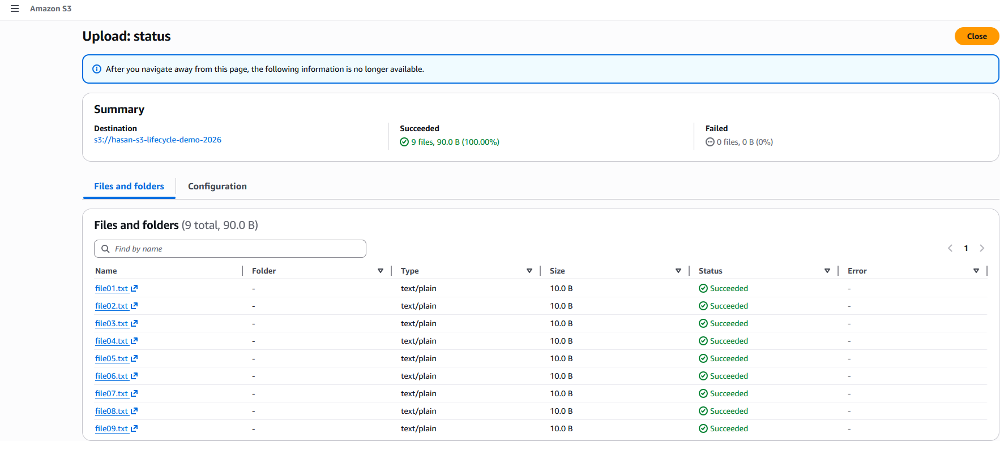
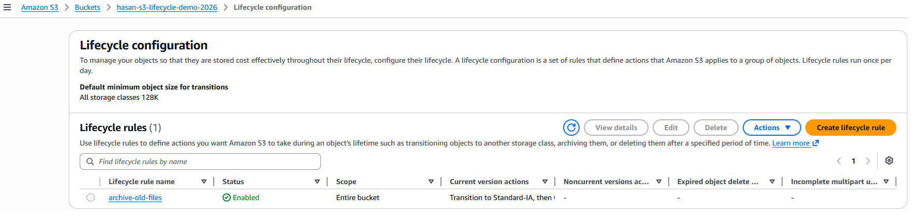
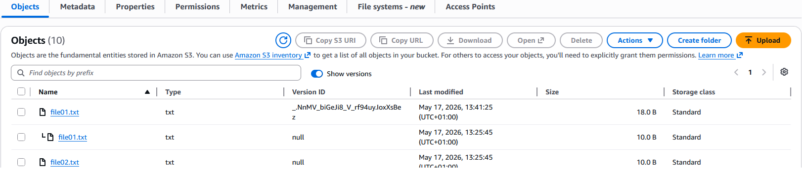

# Project 05 — S3 File Manager with Lifecycle Rules

**Status:** In Progress  
**Week:** 3 | **Date Started:** 15 May 2026  
**AWS Services:** Amazon S3, Lifecycle Rules, Versioning, SSE-S3 Encryption

## What This Project Does
Demonstrates an enterprise-grade S3 bucket configuration with automated data lifecycle 
management — the same pattern used in regulated industries (banking, healthcare, legal) 
for document retention compliance.

## Architecture
[Upload] → S3 Standard (0–30 days, frequent access)
↓ Lifecycle Rule at 30 days
S3 Standard-IA (30–90 days, infrequent access, ~46% cost saving)
↓ Lifecycle Rule at 90 days
S3 Glacier Flexible Retrieval (90–365 days, archived, ~85% cost saving)
↓ Expiration Rule at 365 days
[Deleted automatically]

## Configuration Applied
- ✅ Versioning: Enabled (protects against accidental deletion)
- ✅ Lifecycle Rule: Standard → IA (30d) → Glacier (90d) → Delete (365d)
- ✅ Encryption: SSE-S3 (AES-256, AWS managed keys)
- ✅ Region: eu-west-2 (London)

## Business Use Case
A Leicester law firm needs to retain client documents for 1 year per compliance policy. 
Files are accessed frequently in the first month, rarely after 90 days, and must be 
deleted automatically at the 1-year mark. This configuration saves approximately 70% 
on storage costs compared to keeping everything in S3 Standard.

## Screenshots

### S3 Bucket with 10 Test Files Uploaded

*The S3 bucket after uploading all 10 test files. All objects are in S3 Standard storage class at this point.*

### Lifecycle Rule Configuration

*The lifecycle rule named `archive-old-files` showing the three transitions: Standard → Standard-IA at 30 days → Glacier Flexible Retrieval at 90 days → Expiration at 365 days.*

### Two Versions of the Same File

*After enabling versioning and re-uploading `file01.txt`, both versions are visible using the Show Versions toggle. Each version has a unique Version ID and its own last-modified timestamp.*

## Skills Demonstrated
AWS S3 | Storage Classes | Lifecycle Management | Versioning | Encryption | Cost Optimisation

## Estimated Cost
- 10 small text files in S3 Standard: < £0.01/month
- Lifecycle rules: no charge for the rule itself (charges apply on transition requests)
- Versioning: adds storage cost for old versions — delete old versions after learning
