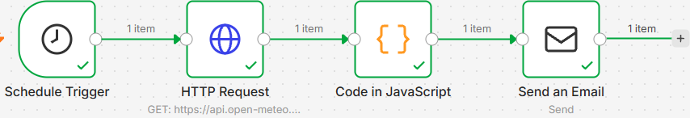
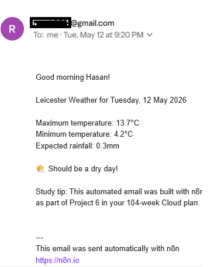
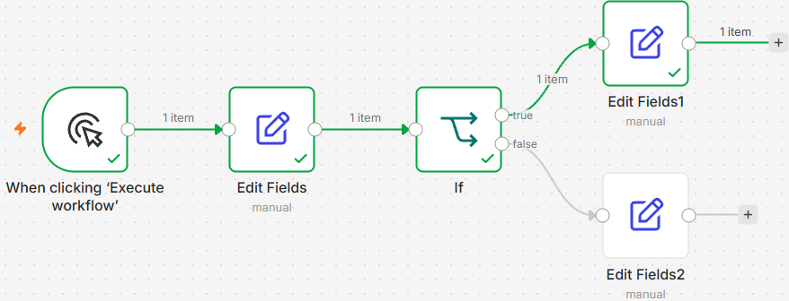

# Project 06 — n8n Business Automation

**Author:** Khandaker Sadain Hasan  
**Location:** Leicester, UK  
**Date started:** 09 May 2026 (Saturday)  
**Status:** ✅ Both workflows built and tested

---

## What Problem Does This Solve?

Small businesses waste hours on repetitive manual tasks:
- Manually checking data from multiple sources daily
- Copying information between systems by hand
- Sending the same type of email repeatedly
- No automated alerts when targets are missed

n8n automates all of this — reducing hours of 
manual work to zero, running 24/7 automatically.

---

## Workflow 1 — Leicester Weather Daily Report

Runs every morning at 8:00am automatically.
Fetches live weather data for Leicester using the 
free Open-Meteo API. Formats into a readable daily 
briefing. Sends via Gmail SMTP automatically.

### Flow
[Schedule Trigger: 8am daily]
↓
[HTTP Request: Open-Meteo API]
GET https://api.open-meteo.com/v1/forecast
?latitude=52.6369&longitude=-1.1398
↓
[Code in JavaScript: Format weather data]
Extracts max/min temp and rainfall.
Builds readable email with emoji logic.
↓
[Send an Email: Gmail SMTP]
Port 465, SSL/TLS, App Password authentication
### Screenshot — Workflow canvas

### Screenshot — Email received

**Status: ✅ Active — running every morning at 8:00am**

### Business use case

Any business needing daily automated reporting:
- Logistics companies checking delivery conditions
- Care companies briefing staff on weather
- Operations managers receiving daily summaries
- Retail managers getting overnight sales reports

**Post-ILR freelance value: £200-400 per client**

---

## Workflow 2 — Study Progress Tracker

Demonstrates conditional logic in n8n.
Evaluates study progress data and returns 
different outputs based on whether targets are met.

### Flow
[When clicking Execute Workflow]
↓
[Edit Fields: Set study data]
week=2, cards_added=40,
target_cards=40, projects_built=2
↓
[IF: cards_added >= 30?]
↓              ↓
[True branch]   [False branch]
Edit Fields1    Edit Fields2
On track ✅     Behind target
### Screenshot — Workflow with conditional logic

**Status: ✅ Built and tested — both branches verified**

### What this demonstrates

- Conditional logic — different paths for different data
- Data creation with Edit Fields (Set) node
- IF node evaluation with number comparison
- True/false branching — foundation of intelligent automation

---

## n8n Core Concepts Demonstrated

| Concept | Workflow | Node used |
|---|---|---|
| Scheduled automation | Workflow 1 | Schedule Trigger |
| Live API data fetching | Workflow 1 | HTTP Request |
| Data transformation | Workflow 1 | Code in JavaScript |
| Email delivery via SMTP | Workflow 1 | Send an Email |
| Manual trigger | Workflow 2 | Execute Workflow |
| Data creation | Workflow 2 | Edit Fields (Set) |
| Conditional logic | Workflow 2 | IF node |
| True/false branching | Workflow 2 | Edit Fields1/2 |

---

## Technical Configuration

### Gmail SMTP Settings
- Host: smtp.gmail.com
- Port: 465
- Security: SSL/TLS
- Authentication: Google App Password

### Weather API
- Provider: Open-Meteo (free, no API key required)
- Endpoint: api.open-meteo.com/v1/forecast
- Location: Leicester, UK (52.6369, -1.1398)
- Data: max/min temperature, rainfall, 1-day forecast

---

## Steps Completed

- [x] Installed n8n on Windows computer
- [x] Created account and explored interface
- [x] Built Workflow 1: Weather email (live and active)
- [x] Configured Gmail SMTP with App Password
- [x] Email received and verified ✅
- [x] Built Workflow 2: Conditional data processing
- [x] IF node true/false branches both tested ✅
- [ ] Add AI summarisation to Workflow 1 (Week 3)
- [ ] Build AI Research Bot (Week 28)
- [ ] Deploy n8n on AWS EC2 for 24/7 (Week 10)
- [ ] Build charity donor automation (Community Project 2)

---

## Cost

| Item | Cost |
|---|---|
| n8n self-hosted | FREE |
| Open-Meteo API | FREE |
| Gmail SMTP | FREE |
| **Total** | **$0** |

---

## Key Things Learned

- n8n auto-saves — no manual save button
- Publish button activates workflow, does not save
- HTTP Request node calls any public API
- Code node runs JavaScript to transform data
- IF node creates true/false conditional paths
- Edit Fields (Set) creates data for next nodes
- SMTP Port 465 = SSL/TLS direct secure connection
- Gmail requires App Password not normal password
- Expression syntax {{ $json.field }} links nodes

---

## Exam and Interview Relevance

| Topic | How this project demonstrates it |
|---|---|
| API integration | HTTP Request to Open-Meteo API |
| Data processing | JavaScript code transforms JSON |
| Conditional logic | IF node with true/false branches |
| Email automation | SMTP configuration and delivery |
| Workflow design | Multi-step automated process |
| Business automation | Real daily value — weather briefing |

---

*Part of a 24-month Cloud + AI Automation Specialist plan*  
*MSc Cloud Computing, University of Leicester*  
*AWS CCP certified January 2022 — AWS SAA target: October 2026*
