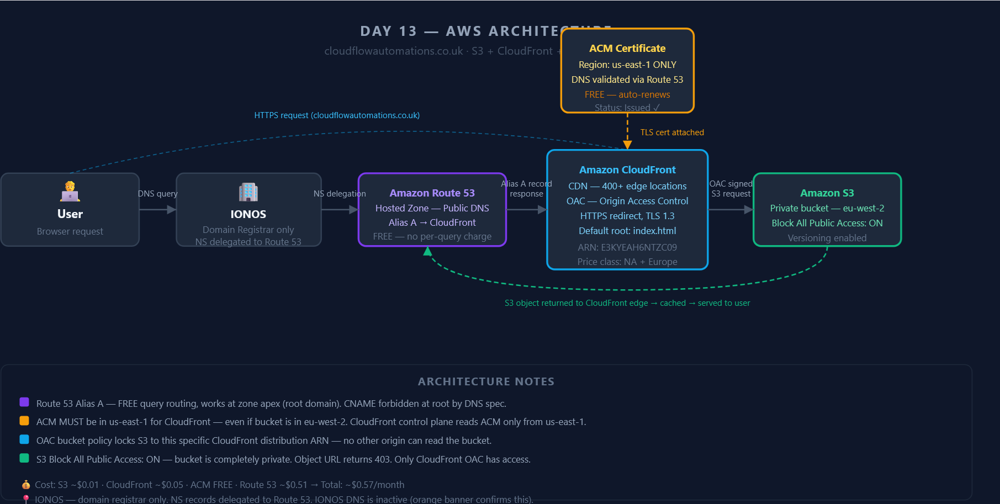
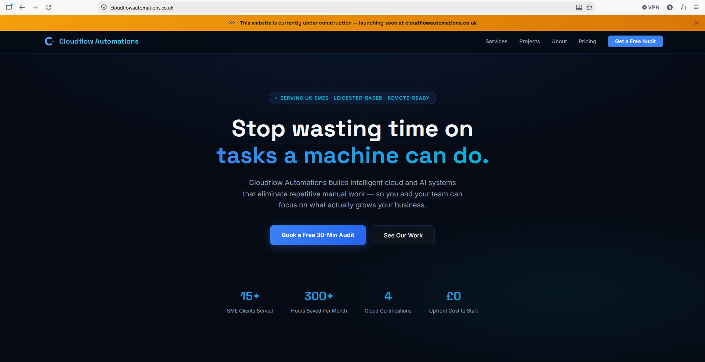
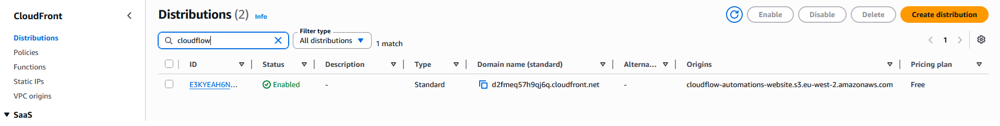
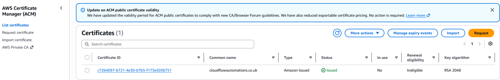
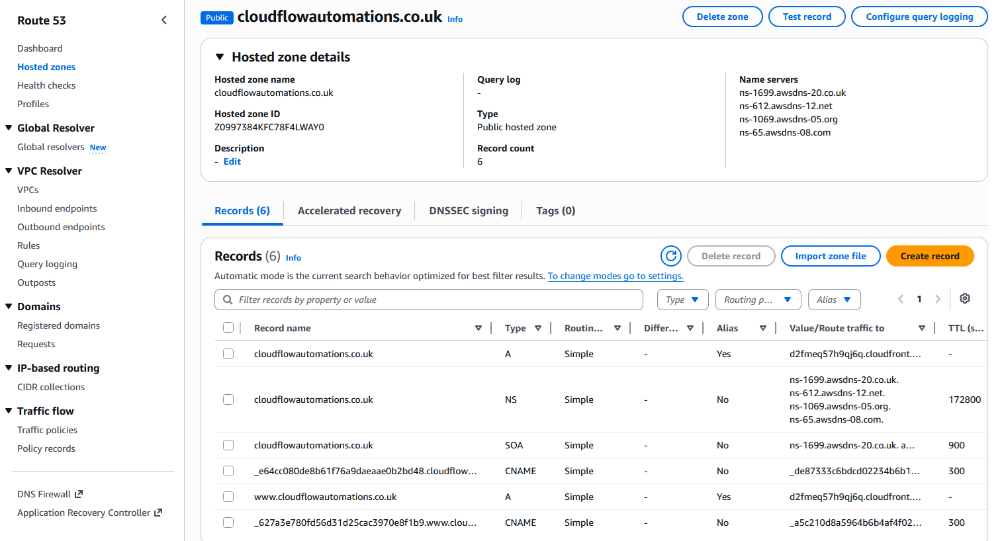

# Project 07 — Cloudflow Automations Company Website

**Live URL:** https://cloudflowautomations.co.uk
**Status:** ✅ LIVE
**Deployed:** May 2026

---

## What Problem Does This Solve?

Most UK small businesses either:
- Pay £10–30/month for slow shared hosting with a control panel they can't manage
- Pay a web agency £500–1,500 upfront + £50/month for a site that sits on a single server
- Have no website at all because it feels too technical or expensive

This project solves that by deploying a production-grade company website with:
- Global CDN — fast loading for anyone in the UK and Europe
- Full HTTPS — required for Google ranking and user trust
- Zero server management — no patches, no server crashes, no downtime from traffic spikes
- Near-zero running cost — under £1/month total

The same architecture that enterprises pay thousands for, running for pocket change.

---

## What This Is

A fully deployed production company website for Cloudflow Automations —
a cloud and AI automation consultancy targeting UK SMEs.

The website is live at cloudflowautomations.co.uk with full HTTPS,
served globally via CloudFront CDN from a completely private S3 bucket.
No server to maintain. No monthly hosting bill beyond $0.50 for DNS.
Scales to millions of visitors with zero infrastructure changes.

---

## Architecture

**Architecture diagram:**

---

## Steps

### Step 1 — Create Private S3 Bucket
- Region: eu-west-2 (London)
- Block All Public Access: ON
- Versioning: Enabled
- Upload: index.html + 4 SVG logo files

### Step 2 — Request ACM Certificate (us-east-1 ONLY)
- Switch region to N. Virginia (us-east-1) before requesting
- Add both root domain and www subdomain to the certificate
- Validation method: DNS validation
- Click "Create records in Route 53" — AWS adds CNAMEs automatically
- Wait for status: Issued (2–5 minutes)

### Step 3 — Create CloudFront Distribution
- Origin: S3 REST endpoint (not website endpoint)
- Origin access: Origin Access Control (OAC) — create new OAC
- Copy OAC bucket policy from yellow banner
- Viewer protocol policy: Redirect HTTP to HTTPS
- Default root object: index.html
- Alternate domain names: cloudflowautomations.co.uk + www
- Custom SSL certificate: attach ACM cert (must show Issued)
- Price class: North America and Europe

### Step 4 — Apply OAC Bucket Policy to S3
- Go to S3 → Permissions → Bucket policy → Edit
- Paste the OAC policy copied from CloudFront
- Policy restricts access to the specific distribution ARN only

### Step 5 — Create Route 53 Alias A Records
- Record 1: root domain (blank name) → Alias → CloudFront distribution
- Record 2: www → Alias → same CloudFront distribution
- Both records: Type A, Alias ON, Region US East (N. Virginia)

### Step 6 — Test
- Wait 10–15 minutes for SSL propagation to 400+ edge locations
- Test raw CloudFront URL first: https://d2fmeq57h9qj6q.cloudfront.net
- Then test custom domain: https://cloudflowautomations.co.uk
- Then test www: https://www.cloudflowautomations.co.uk

---

## Why This Architecture?

**Why S3 instead of a web server (EC2)?**
Static websites have no server-side logic — HTML, CSS, and JavaScript are just files.
S3 stores files. No reason to run a server 24/7 just to serve files when S3 does it
for fractions of a penny per request, with no patching, no crashes, no management.

**Why CloudFront instead of serving directly from S3?**
S3 is a single region (eu-west-2). Without a CDN the response always comes from one
fixed location. CloudFront caches the files at 400+ edge locations globally so every
user gets the response from the nearest location — faster loading, lower latency.
CloudFront also handles HTTPS termination and forces HTTP → HTTPS at the edge.

**Why OAC instead of making S3 public?**
A public S3 bucket can be accessed directly by anyone with the URL — bypassing
CloudFront entirely. This means no HTTPS enforcement, no CDN caching, and no security
control. OAC keeps the bucket completely private. Only the specific CloudFront
distribution (locked by ARN in the bucket policy) can call s3:GetObject.

**Why Route 53 Alias A instead of CNAME?**
DNS RFC 1912 forbids CNAME records at the zone apex — the root of a domain. You cannot
have cloudflowautomations.co.uk as a CNAME. AWS Alias records solve this — they resolve
as A records at the DNS level, auto-update if CloudFront IPs change, and are completely
free (no per-query charge unlike CNAME).

**Why ACM in us-east-1 even though S3 is in eu-west-2?**
CloudFront's management control plane runs from us-east-1. ACM certificates are
region-specific. CloudFront can only read ACM from us-east-1. A certificate created
in eu-west-2 is invisible to CloudFront. This is the single most common mistake
with this setup.

---

## Exam Relevance (AWS SAA-C03)

| Topic | Exam Point |
|---|---|
| S3 + CloudFront | Classic SAA pattern — private S3 served via CloudFront with OAC |
| OAC vs OAI | OAI is deprecated. OAC is the correct modern answer. If both appear, choose OAC. |
| ACM region | ACM for CloudFront = us-east-1 ALWAYS — regardless of S3 region or user location |
| Alias vs CNAME | CNAME cannot be used at zone apex. Alias A = free, works at root domain. Always use Alias for AWS resources. |
| Route 53 routing | Simple routing used here — one CloudFront origin, no health checks needed |
| CloudFront Invalidation | To serve updated S3 content immediately: create Invalidation with path /* |
| Default Root Object | Forgetting index.html = 403 on root URL. Classic SAA trick question. |
| SSL propagation | CloudFront distributes cert to 400+ edge locations — takes 10–15 mins. Not an error. |

**Likely SAA exam scenarios this project covers:**
- "A company wants to host a static website with custom domain and HTTPS. Which services?" → S3 + CloudFront + ACM + Route 53
- "Users get 403 when visiting the root domain but /about.html works fine." → Missing Default Root Object
- "How do you prevent direct access to S3 while serving via CloudFront?" → OAC bucket policy
- "Certificate created in eu-west-2 is not showing in CloudFront." → Must be in us-east-1

---

## AWS Services Used

### Amazon S3
- Private bucket: cloudflow-automations-website (eu-west-2)
- Block All Public Access: ON
- Versioning: enabled
- OAC bucket policy — only distribution ARN E3KYEAH6NTZC09 can call s3:GetObject
- Cost: ~$0.01/month

### AWS CloudFront
- Distribution ARN: E3KYEAH6NTZC09
- OAC, HTTPS redirect, TLS 1.3, Default root object: index.html
- Alternate domains: cloudflowautomations.co.uk + www
- Price class: North America and Europe
- Cost: ~$0.05/month

### AWS Certificate Manager (ACM)
- Region: us-east-1 — REQUIRED for CloudFront
- DNS validated via Route 53 — one-click
- Cost: FREE

### Amazon Route 53
- Public hosted zone: cloudflowautomations.co.uk
- 2x Alias A records → CloudFront
- Cost: $0.50/month hosted zone + ~$0.01 queries

---

## Cost

| Service | Cost |
|---|---|
| S3 storage | ~$0.01/month |
| CloudFront | ~$0.05/month |
| ACM certificate | FREE |
| Route 53 | ~$0.51/month |
| **Total** | **~$0.57/month** |

---

## Business Value

This architecture is directly sellable to UK SMEs post-ILR (October 2027):

| Client | Setup Fee | Monthly Support |
|---|---|---|
| Local restaurant / cafe | £300–500 | £50/month |
| Solicitor / accountant firm | £400–600 | £75/month |
| Charity or community group | £200–350 | £40/month |
| Estate agent / letting agent | £500–700 | £100/month |

**Running cost: ~$0.57/month. Client value: £300–700 setup + retainer. That margin is the model.**

---

## Screenshots

**Live website with HTTPS padlock:**

**CloudFront — Enabled:**

**ACM Certificate — Issued:**

**Route 53 records:**

