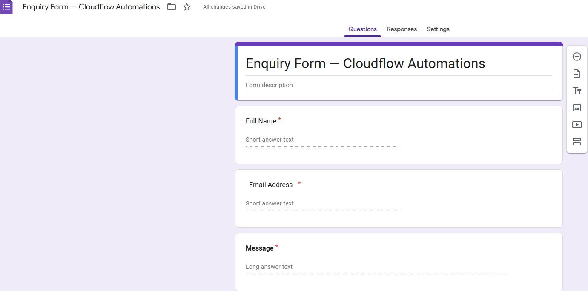
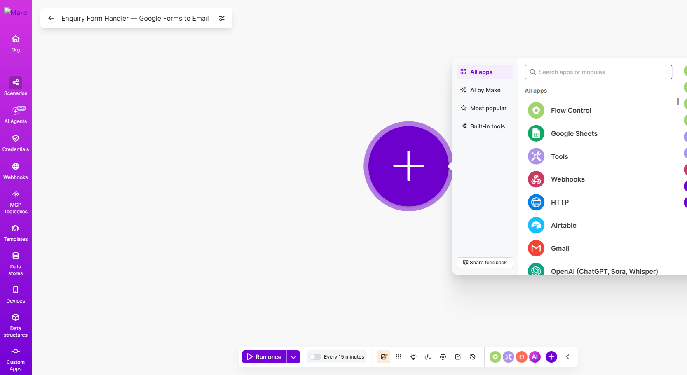
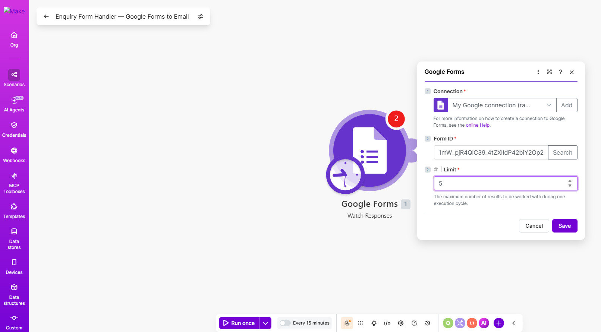
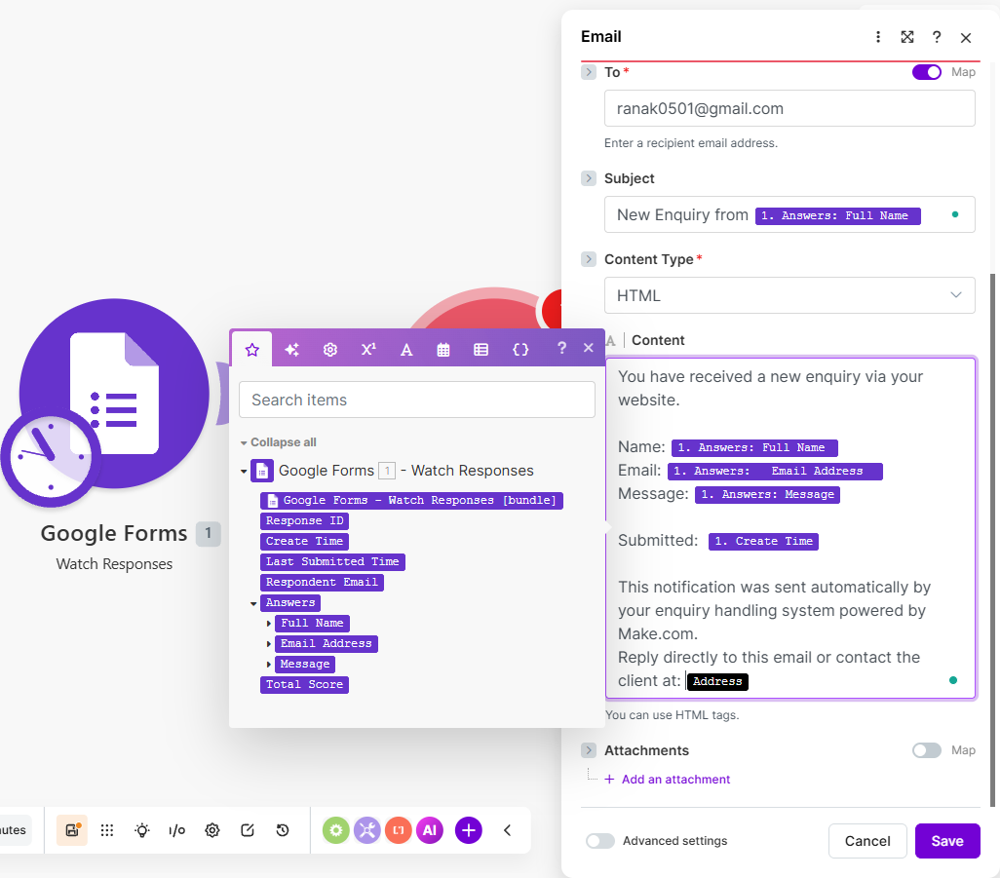
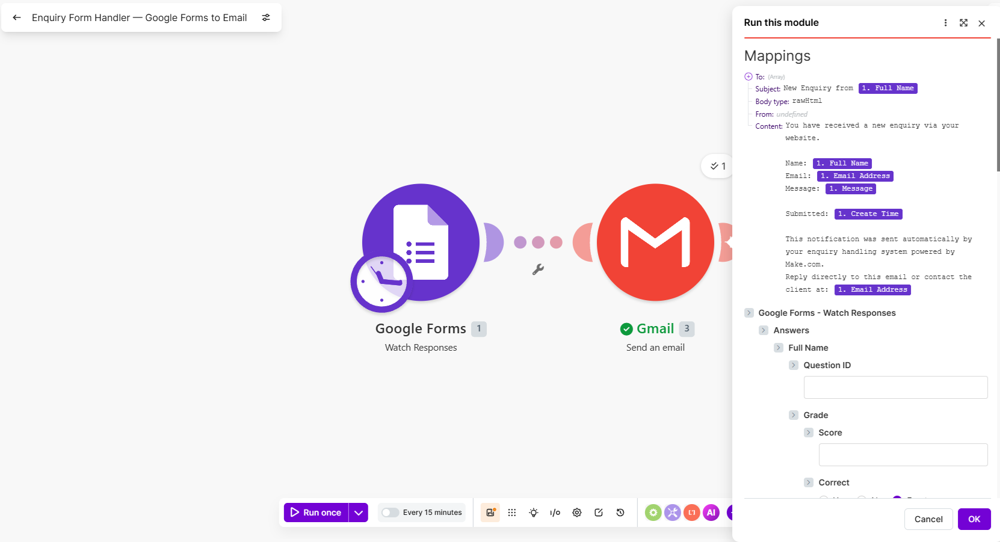
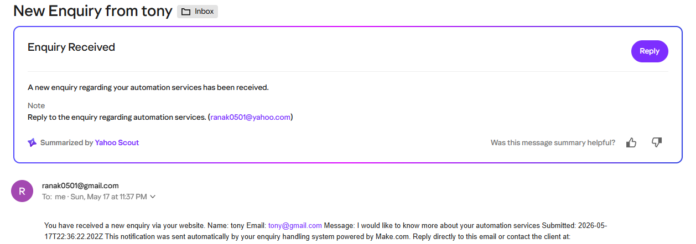

# Project 07.2 — Make.com: Google Forms to Gmail Enquiry Automation

**Status:** Live (Make.com free tier)
**Built:** 16 May 2026
**Tools:** Make.com · Google Forms · Email
**GitHub:** https://github.com/SadainHasan/cloud-ai-portfolio
**Portfolio site:** https://d2ven7lubrbrhs.cloudfront.net
**Business site:** https://cloudflowautomations.co.uk
**Builder:** Khandaker Sadain Hasan | Cloud + AI Automation Consultant

---

## What Problem Does This Solve?

A potential client visits a small business website, fills in the contact form,
and waits. The business owner — usually running operations, doing client work,
and managing admin simultaneously — checks their Google Forms responses
every day or two. By the time they respond, the prospect has already contacted
two competitors who replied within the hour.

For service businesses (accountants, solicitors, consultants, tradespeople,
freelancers), every missed or delayed enquiry response is a lost client.
Research shows that responding to an inbound enquiry within five minutes
increases conversion by over 300% compared to responding after 30 minutes.

This automation solves the problem completely. When someone submits the
enquiry form, Make.com detects the new response within 15 minutes, formats
the client's name, email, and message into a clean notification email, and
delivers it directly to the business owner's inbox. The owner can reply
to the client directly from that email in seconds — without opening Google
Sheets, without checking a form dashboard, without missing anything.

---

## What This Is

A Make.com scenario connecting Google Forms to Gmail. The scenario triggers
on new form responses, extracts the submitted data (full name, email address,
and message), and composes a formatted notification email to the business owner.
No code required. The entire scenario is built visually in the Make.com interface.

This project is a companion to Project 07.1. Where Project 07.1 demonstrates
Google Sheets → Slack (internal team notification), this project demonstrates
Google Forms → Email (external enquiry handling). Together they show two of
the most common SME automation use cases.

---

## Architecture
┌─────────────────────────────────────────────────────────────┐
│                     CLIENT JOURNEY                          │
│                                                             │
│  1. Client visits cloudflowautomations.co.uk                │
│  2. Client fills in the enquiry form                        │
│     (Full Name, Email Address, Message)                     │
│  3. Google Forms stores the response                        │
│                                                             │
└─────────────────────────┬───────────────────────────────────┘
│ New response detected (polling, ~15 min)
▼
┌─────────────────────────────────────────────────────────────┐
│                    MAKE.COM SCENARIO                         │
│                                                             │
│  [Trigger: Google Forms — Watch Responses]                  │
│     • Polling trigger: checks every 15 minutes              │
│     • Detects: new form submissions                         │
│     • Extracts: Full Name, Email Address, Message           │
│                                                             │
│            ↓ bundle flows to next module ↓                  │
│                                                             │
│  [Action: Email — Send an Email]                            │
│     • To: business owner's email                            │
│     • Subject: New Enquiry from {{1.Full Name}}             │
│     • Body: all form fields mapped + reply instructions     │
└─────────────────────────┬───────────────────────────────────┘
│
▼
┌─────────────────────────────────────────────────────────────┐
│             BUSINESS OWNER INBOX                            │
│                                                             │
│  Subject: New Enquiry from Test Client                      │
│  Body:                                                      │
│   Name: Test Client                                         │
│   Email: test@example.com                                   │
│   Message: I'd like to find out more about your services.   │
│   Reply directly to the client at: test@example.com         │
└─────────────────────────────────────────────────────────────┘
---

## Steps

### Step 1: Create the Google Form

1. Opened forms.google.com
2. Created new blank form
3. Named it: Enquiry Form — Cloudflow Automations
4. Added field 1: Full Name (short answer, required)
5. Added field 2: Email Address (short answer, required)
6. Added field 3: Message (paragraph, required)
7. Saved and copied the form share link
8. Opened the link in a new browser tab
9. Submitted a test response:
   - Full Name: Test Client
   - Email Address: test@example.com
   - Message: I'd like to find out more about your automation services.
   This test response gives Make.com real data to process during setup.

### Step 2: Create the Make.com Scenario

1. Clicked + Create a new scenario in Make.com
2. Named it: Enquiry Form Handler — Google Forms to Email
3. Clicked Save icon to save immediately

### Step 3: Add the Google Forms Trigger

1. Clicked the + circle on the blank canvas
2. Searched for Google Forms
3. Selected Watch Responses (polling trigger)
4. Reused existing Google OAuth2 connection from Project 07.1
5. Selected the Enquiry Form from the dropdown
6. Set Maximum number of results: 5 (for testing)
7. Clicked OK

### Step 4: Test the Trigger

1. Right-clicked Google Forms module → Run this module only
2. Output bubble appeared: 1 bundle
3. Clicked bubble — confirmed all three fields present:
   - Full Name: Test Client
   - Email Address: test@example.com
   - Message: I'd like to find out more about your automation services.

### Step 5: Add the Gmail Action Module

1. Clicked + to the right of Google Forms module
2. Searched for Gmail
3. Selected Send an Email
   (Uses Make.com's built-in email relay — no Gmail connection required)

### Step 6: Configure the Email

Applied these settings in the Email module:
- To: [business owner email address]
- Subject: mapped as — New Enquiry from {{1.Full Name}}
- Content: (full template with all fields mapped)

Final email content:
You have received a new enquiry via your website.
Name: {{1.Full Name}}
Email: {{1.Email Address}}
Message: {{1.Message}}
Submitted: {{1.Date Created}}
This notification was sent automatically by your enquiry handling system
powered by Make.com.
Reply directly to this email or contact the client at: {{1.Email Address}}

Clicked Save. Saved entire scenario with the toolbar Save icon.

### Step 7: Test the Full Scenario

1. Clicked Run once
2. Google Forms module: green bubble — 1 bundle processed
3. Email module: green bubble — 1 bundle processed
4. Checked inbox — email received
5. Subject line: "New Enquiry from Test Client" ✅
6. Body: all three fields correctly populated ✅
7. Client email address present in reply instructions ✅

### Step 8: Activate the Scenario

Toggled scenario On. Make.com now checks for new Google Form
responses every 15 minutes and sends a notification email automatically.

---

## Data Mapping in Make.com

The {{module_number.field_name}} syntax is how Make.com passes data between modules.

| Variable | Source | Destination |
|----------|--------|-------------|
| {{1.Full Name}} | Google Forms module (module 1) | Email Subject + Body |
| {{1.Email Address}} | Google Forms module (module 1) | Email Body |
| {{1.Message}} | Google Forms module (module 1) | Email Body |
| {{1.Date Created}} | Google Forms module (module 1) | Email Body |

Module 1 = the Google Forms trigger. If a third module were added (e.g., log
to Notion), it would reference data from modules 1 and 2 using their respective
numbers.

---

## Why This Architecture?

### Why Google Forms instead of a custom webhook form?

Google Forms is the correct starting point for most SME clients. It is free,
requires zero technical setup, and the client already has a Google account.
A custom HTML form with a Make.com webhook trigger (using the Webhooks module)
would deliver real-time instead of near-real-time responses, but it requires
a developer to embed the form on the website. For a first engagement, Google
Forms delivers 90% of the value with 10% of the complexity.

The upgrade path is clear: once the client sees value in this automation
and wants faster response times, replace the Google Forms trigger with a
webhook-based custom form. That is a Phase 2 engagement, not a Phase 1.

### Why Make.com's built-in email relay?

Using Make.com's own Gmail relay (rather than connecting the client's Gmail
or Outlook account) keeps the setup simple and avoids OAuth complications
during the initial build. For a production client deployment, connecting
their own email account via Gmail or Outlook modules is preferred —
it means the notification emails come from a recognisable address (e.g.,
info@clientbusiness.co.uk) rather than a Make relay address, which looks
more professional and is less likely to land in spam.

### Why polling instead of instant trigger?

Like Google Sheets, Google Forms does not expose a native webhook endpoint.
Polling is the correct architecture. The 15-minute window is acceptable
for an enquiry notification scenario — a business owner checking email
every few hours will still respond faster than one manually checking
Google Forms once per day.

---

## Comparison: Project 07.1 vs Project 07.2

| | Project 07.1 | Project 07.2 |
|-|-------------|-------------|
| Trigger | Google Sheets — Watch New Rows | Google Forms — Watch Responses |
| Action | Slack — Send a Message | Email — Send an Email |
| Data source | Manual spreadsheet entry | Online form submission |
| Notification channel | Slack (team) | Email (individual) |
| Use case | Internal sales team notification | External enquiry handling |
| Real-time? | No (polling, ~15 min) | No (polling, ~15 min) |
| Client self-service | Yes (add rows to spreadsheet) | Yes (share the form link) |

---

## Exam Relevance (AWS SAA-C03)

| Concept | AWS Equivalent | Why It Matters |
|---------|---------------|----------------|
| Polling trigger | EventBridge Scheduler + Lambda | Scheduled event-driven processing |
| Webhook/instant trigger | API Gateway → Lambda | Real-time event-driven architecture |
| Data mapping between modules | Lambda passing event data to next function | Serverless data flow patterns |
| Free tier operation limits | Lambda 1M free requests/month | Cost-aware architecture design |
| OAuth2 connections | IAM roles + Secrets Manager | Secure cross-service access |

---

## Tools Used

### Make.com
- Plan: Free (1,000 operations/month)
- Scenario: Enquiry Form Handler — Google Forms to Email
- Trigger: Google Forms — Watch Responses (polling, every 15 minutes)
- Action: Email — Send an Email (Make.com relay)
- Operations per enquiry: 2 (1 trigger check + 1 email send)
- Connection: Reused Google OAuth2 from Project 07.1

### Google Forms
- Form name: Enquiry Form — Cloudflow Automations
- Fields: Full Name, Email Address, Message (all required)
- Responses: Auto-saved to Google Sheets by Google
- Cost: Free

### Gmail
- Delivery: Make.com built-in relay
- Cost: Included in free tier

---

## Cost

| Resource | Monthly Cost | Notes |
|----------|-------------|-------|
| Make.com free tier | £0 | 1,000 ops/month covers ~500 enquiries |
| Google Forms | £0 | Free with Google account |
| Email relay | £0 | Included in Make.com plan |
| **Total** | **£0/month** | |

**Client pricing reference (post-ILR volunteer baseline):**
- Setup fee: £150–£300 (2–4 hours including form design, build, test, handover)
- Monthly support: £0–£50/month depending on complexity

**ROI for client handling 20 enquiries/week:**
- Time saved per enquiry: ~9 minutes (manual checking + formatting + forwarding)
- Time saved per week: ~3 hours
- Annual hours recovered: ~150 hours
- At £20/hour equivalent: £3,000 of recovered time per year
- Payback period: first month

---

## Business Value

| Client Type | Problem | Value |
|-------------|---------|-------|
| Sole trader / freelancer | Missing enquiries in Google Sheets | Email notification within 15 min |
| Small service business | Manual form-checking routine | 3+ hours/week recovered |
| Local charity | Volunteer sign-ups unnoticed | Coordinator alerted instantly |
| Estate agent | Property viewing requests delayed | Sub-15-minute response time |
| Fitness instructor | Class booking enquiries missed | Every enquiry actioned same day |

---

## Next Steps

- **Project 07.3:** Add a third module — log every enquiry to a Notion database
  (name, email, message, timestamp, status: New/Contacted/Closed)
- **Project 07.4:** Replace Google Forms trigger with a Make.com Webhook trigger
  and a custom HTML form embedded on cloudflowautomations.co.uk for real-time delivery
- **Project 08:** Combined pipeline — enquiry arrives via form → Make.com sends email
  notification → also triggers AWS Lambda via API Gateway to classify the enquiry
  using Claude AI (urgent/normal/spam) and route accordingly

---

## Screenshots

### Google Form Created

### Scenario Builder

### Google Forms Trigger Module

### Gmail Module Connected

### Data Mapping

### Successful Test Run

### Email Received in Inbox

### Scenario Live

---

*Built as part of the 104-week Cloud + AI Automation portfolio*
*GitHub: https://github.com/SadainHasan/cloud-ai-portfolio*
*Business: https://cloudflowautomations.co.uk*
