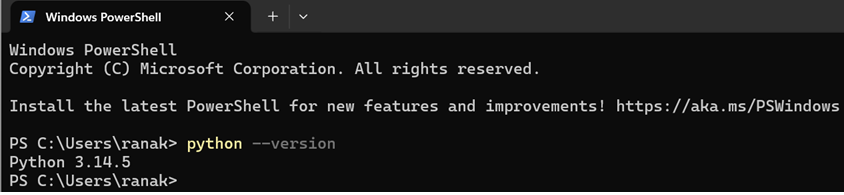
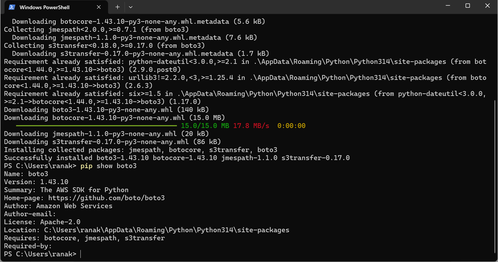
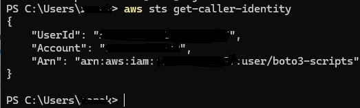
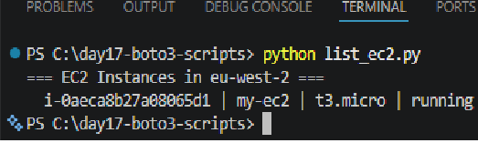
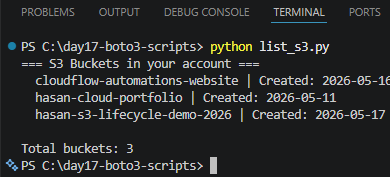
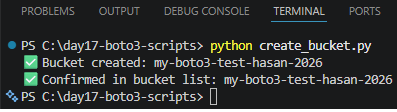
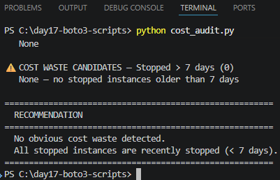

# Project 08 — AWS Cost Audit Tool (Python + boto3)

**Status:** Complete
**Built:** 17 May 2026
**Language:** Python 3.12
**Library:** boto3 (AWS SDK for Python)
**AWS Services:** EC2, S3
**Region:** eu-west-2 (London)
**GitHub:** https://github.com/SadainHasan/cloud-ai-portfolio
**Portfolio site:** https://d2ven7lubrbrhs.cloudfront.net
**Business site:** https://cloudflowautomations.co.uk
**Builder:** Khandaker Sadain Hasan | Cloud + AI Automation Consultant

---

## What Problem Does This Solve?

Every business running AWS resources faces the same invisible cost problem:
someone launches an EC2 instance for a project, the project finishes or pauses,
the instance gets stopped — and then nobody touches it again. The instance is
stopped, so there are no compute charges. But the EBS volume attached to it
keeps accumulating storage charges at $0.10 per GB per month, every month,
silently. Three months later, the business has paid for storage on five
forgotten instances and nobody noticed because the bill just crept up gradually.

For an SME with a 10–20 person tech team, this kind of unmanaged resource
accumulation can cost hundreds of pounds per year in unnecessary AWS charges.
Larger organisations lose thousands. The problem is not the cost of any single
instance — it is the lack of visibility. Nobody has a simple report that shows:
"these are the instances that have been stopped for more than a week and may be
safe to terminate."

This tool solves that problem. It connects to the AWS account via boto3, pulls
the current state of all EC2 instances, and generates a plain-English report
identifying any stopped instances older than 7 days — the candidates for review
and potential termination. Run it weekly as part of a cost governance routine
and it pays for itself in the first month.

---

## What This Is

A Python command-line script that uses the AWS SDK (boto3) to audit EC2
instances and generate a cost waste report. The script categorises instances
as running or stopped, calculates how long each stopped instance has been in
that state, and flags any that have been stopped for more than 7 days as cost
waste candidates. The output is a formatted terminal report that a non-technical
manager could read and act on.

This is the foundation of a broader AWS cost management service that the
Cloudflow Automations business will offer post-ILR. The same pattern (connect
via boto3, query AWS, generate report) applies to S3 storage audits, unused
Elastic IPs, forgotten RDS snapshots, and idle NAT Gateways — all common
sources of unnecessary AWS spend.

---

## Architecture
┌─────────────────────────────────────────────────────────────┐
│                    LOCAL MACHINE                            │
│                                                             │
│  cost_audit.py                                              │
│  ├── boto3.client('ec2', region='eu-west-2')                │
│  └── ec2.describe_instances()                               │
│                                                             │
└─────────────────────────┬───────────────────────────────────┘
│ HTTPS API call
▼
┌─────────────────────────────────────────────────────────────┐
│                    AWS (eu-west-2)                          │
│                                                             │
│  EC2 API — describe_instances                               │
│  Returns: instance ID, state, type, launch time, tags       │
│                                                             │
└─────────────────────────┬───────────────────────────────────┘
│ JSON response
▼
┌─────────────────────────────────────────────────────────────┐
│                    REPORT OUTPUT                            │
│                                                             │
│  ✅ RUNNING INSTANCES — currently incurring compute costs   │
│  🔴 STOPPED INSTANCES — incurring EBS storage costs only   │
│  ⚠️  COST WASTE CANDIDATES — stopped > 7 days, review now  │
│  RECOMMENDATION — plain English action to take             │
└─────────────────────────────────────────────────────────────┘
---

## Scripts Built Today

### Script 1: list_ec2.py
Lists all EC2 instances in eu-west-2 with their ID, name tag, instance type,
and current state. Read-only API call. Cost: £0.

### Script 2: list_s3.py
Lists all S3 buckets in the account with their names and creation dates.
Read-only API call. Cost: £0.

### Script 3: create_bucket.py
Creates a test S3 bucket programmatically using boto3. Demonstrates that
Python can provision AWS infrastructure directly — the same pattern used
in Infrastructure as Code automation. Bucket deleted immediately after testing.

### Script 4: cost_audit.py (Portfolio Project)
Full cost audit tool — see What Problem Does This Solve above.

---

## Steps

### Step 1: Environment Setup
1. Verified Python 3.12 installed: `python --version`
2. Installed boto3: `pip install boto3`
3. Verified: `pip show boto3`

### Step 2: AWS Credentials Configuration
1. Created dedicated IAM user: boto3-scripts
2. Attached policies: AmazonEC2ReadOnlyAccess + AmazonS3FullAccess
3. Generated Access Key (type: Local code)
4. Ran `aws configure` with Access Key ID, Secret Access Key, region eu-west-2, output json
5. Verified: `aws sts get-caller-identity` returned account details

### Step 3: Script 1 — list_ec2.py
1. Created file list_ec2.py in VS Code
2. Used boto3.client('ec2') to call describe_instances()
3. Iterated over Reservations → Instances to extract ID, name tag, type, state
4. Ran: `python list_ec2.py`
5. Output showed all EC2 instances with state labels

### Step 4: Script 2 — list_s3.py
1. Created file list_s3.py
2. Used boto3.client('s3') to call list_buckets()
3. Printed bucket names and creation dates
4. Ran: `python list_s3.py`
5. Output showed all S3 buckets including portfolio site bucket

### Step 5: Script 3 — create_bucket.py
1. Created file create_bucket.py
2. Used s3.create_bucket() with LocationConstraint eu-west-2
3. Added error handling for BucketAlreadyOwnedByYou
4. Ran: `python create_bucket.py`
5. Confirmed bucket appeared in list_s3.py output
6. Deleted bucket immediately after (see Resource Cleanup)

### Step 6: Script 4 — cost_audit.py
1. Created file cost_audit.py
2. Called describe_instances() to get all EC2 instances
3. Calculated days since launch using datetime and timezone.utc
4. Categorised instances: running, stopped, waste_candidates (stopped > 7 days)
5. Generated formatted terminal report with recommendations
6. Ran: `python cost_audit.py`

---

## Why This Architecture?

### Why boto3 instead of the AWS Console?

The AWS Console requires a human to log in, navigate to EC2, filter by state,
and manually compare dates. That takes 10–15 minutes per account. boto3 runs
the same audit in under 2 seconds. More importantly, boto3 can be scheduled —
the same script can run automatically every Monday morning via a cron job,
a Lambda function, or a Windows Task Scheduler entry, and email the report
without human intervention.

For a consultant managing multiple client AWS accounts, a boto3 script that
runs across all accounts and consolidates results is the difference between
a manual review process and a managed service.

### Why flag > 7 days specifically?

Seven days is a reasonable threshold for distinguishing "intentionally stopped
for a short period" from "forgotten and accumulating cost." A developer might
stop an instance on Friday and restart it Monday — that is 3 days, clearly
intentional. An instance stopped for 14, 30, or 90 days almost certainly
represents a forgotten resource. The 7-day threshold can be adjusted per
client based on their engineering team's working patterns.

### Why read-only for most scripts?

The describe_instances call requires only ec2:DescribeInstances. The IAM user
created for these scripts has read-only access to EC2 — it cannot start, stop,
or terminate instances. This is the principle of least privilege: the script
can see everything but change nothing. For a cost audit tool, this is exactly
right. Actions (termination) should always be taken by a human after reviewing
the report, not automated without oversight.

---

## Exam Relevance (AWS SAA-C03)

| Topic | What This Teaches | SAA-C03 Scenario |
|-------|------------------|-----------------|
| boto3 / AWS SDK | How applications authenticate and call AWS APIs | "An application needs to access S3 — which authentication method?" |
| IAM least privilege | Creating a user with only the permissions it needs | "Which IAM policy gives minimum access for EC2 read?" |
| aws configure | Local credential storage (~/.aws/credentials) | "Where does the AWS CLI store credentials?" |
| describe_instances | EC2 API call pattern — filter, paginate, extract | "How does an application list EC2 instances in a region?" |
| LocationConstraint | S3 bucket must specify region outside us-east-1 | "A bucket creation fails in eu-west-2 — why?" |

---

## AWS Services Used

### EC2 (describe_instances)
- API call: ec2.describe_instances()
- Cost: Free (read-only, no charge for describe calls)
- IAM permission required: ec2:DescribeInstances
- Region: eu-west-2

### S3 (list_buckets, create_bucket)
- list_buckets: Free (read-only)
- create_bucket: Free to create; storage charged at $0.023/GB/month
- Test bucket deleted immediately after session
- IAM permissions: s3:ListAllMyBuckets, s3:CreateBucket, s3:DeleteBucket

---

## Cost

| Resource | Cost | Notes |
|----------|------|-------|
| boto3 API calls (describe) | £0 | Read-only calls are free |
| S3 test bucket (created + deleted) | £0 | No objects stored, deleted same session |
| IAM user (boto3-scripts) | £0 | IAM users are always free |
| **Total** | **£0** | |

---

## Business Value

| Client Type | Pain Solved | Value |
|-------------|-------------|-------|
| SME on AWS (5–50 staff) | No visibility on stopped EC2 waste | Weekly audit saves £50–£500/month |
| Tech startup | Engineers forget to clean up dev instances | Automated report catches waste before it compounds |
| Agency managing client AWS | Manual account review takes hours | boto3 script reviews all accounts in seconds |
| Finance team | AWS bill growing with no explanation | Clear report showing exactly which resources to cut |

**Consulting service potential (post-ILR):**
- One-off AWS cost audit: £200–£500
- Monthly managed cost governance service: £100–£300/month
- This script is the foundation of that service

---

## Screenshots

## Screenshots

---

*Built as part of the 104-week Cloud + AI Automation portfolio*
*GitHub: https://github.com/SadainHasan/cloud-ai-portfolio*
*Business: https://cloudflowautomations.co.uk*
