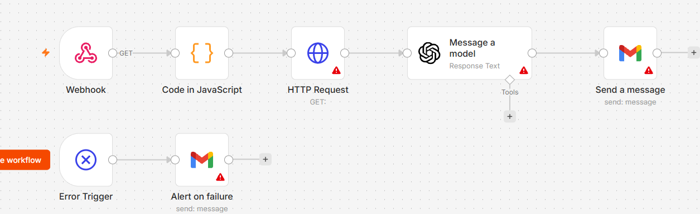
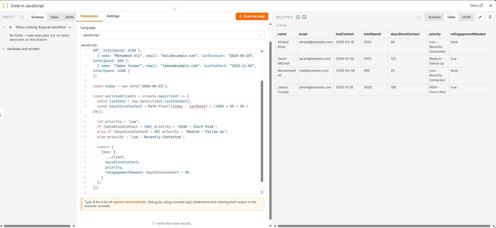
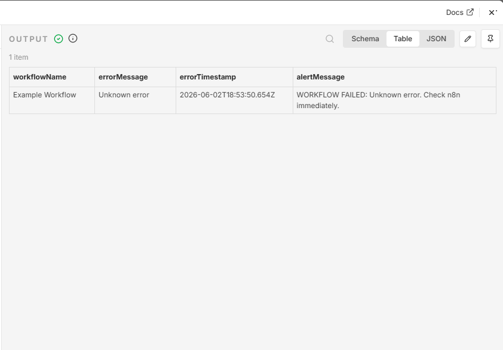
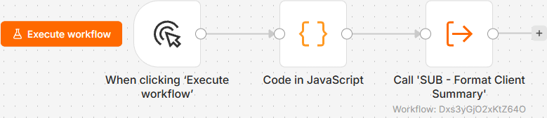

# Project 08 — n8n Research Bot

**Status:** In Progress | **Started:** 23 May 2026 | **Region:** Local (n8n localhost:5678)
**GitHub:** https://github.com/SadainHasan/cloud-ai-portfolio/tree/main/project-08-n8n-research-bot

---

## What Problem Does This Solve?

A small business owner in Leicester runs a digital marketing agency. Every Monday morning, they spend 45 minutes searching Google for industry news, reading 8–10 articles, picking 3 relevant stories, summarising them, and emailing the summary to their team. This happens every week, without fail, for 52 weeks a year — that is 39 hours per year of senior time spent on a task a machine can do in 90 seconds.

This n8n Research Bot eliminates that task entirely. Send a Webhook request with a topic name. The bot searches the web, pulls the top results, sends them to OpenAI for a plain-English summary, and emails the finished digest to whoever needs it. The business owner checks their inbox on Monday morning and finds their research already done — formatted, concise, and ready to forward to the team.

The same workflow works for a law firm monitoring case law updates, an estate agent tracking property market news, a GP surgery watching NHS policy changes, or an accountant following HMRC announcements. One build. Infinite applications.

---

## What This Is

This is an n8n automation workflow running on a local n8n instance (localhost:5678) that chains four actions together: receive a topic via Webhook → search the web for current results → summarise findings using OpenAI → email the summary to a specified address. It demonstrates three advanced n8n capabilities: JavaScript Function nodes for data transformation, Error Handler nodes for production-grade reliability, and Sub-Workflows for modular reuse across multiple client automations.

The workflow is built using n8n's visual node editor and requires no custom infrastructure. The only external services used are a web search API (SerpAPI or Tavily, both have free tiers) and the OpenAI API. Total running cost per research summary: approximately $0.01–$0.03 in OpenAI tokens.

---

## Architecture

```
[Webhook Trigger]
      |
      v
[Code Node: Extract Topic]
      |
      v
[HTTP Request: Search Web (SerpAPI/Tavily)]
      |
      v
[Code Node: Format Search Results]  <-- JavaScript Function Node
      |
      v
[OpenAI Node: Summarise Results]
      |
      v
[Code Node: Format Email Body]  <-- Sub-Workflow candidate
      |
      v
[Gmail Node: Send Summary Email]
      |
      v
[Error Trigger: Catch Failures]  <-- Error Handler Node
      |
      v
[Gmail Node: Alert on Failure]
```

All nodes run inside n8n at localhost:5678. The workflow is triggered via HTTP POST to the Webhook endpoint. No AWS services are used in this workflow — this is a pure automation layer sitting above cloud infrastructure.

---

## Steps

### Day 23 — Scaffold (Today)

1. Open n8n at localhost:5678. Click **New Workflow**. Name it `Project 08 - n8n Research Bot v1`.
2. Add a **Webhook** trigger node. Set method to POST. Set path to `/research-bot`. Note the webhook URL shown (e.g. `http://localhost:5678/webhook/research-bot`).
3. Add a **Code** node. Connect it to the Webhook. Name it `Extract Topic`. Paste the topic extraction logic.
4. Add an **HTTP Request** node. Connect to Code node. Name it `Search Web`. Leave URL blank for now — you will configure SerpAPI or Tavily on Day 24.
5. Add an **OpenAI** node. Connect to HTTP Request. Set to **Message a Model**. Leave prompt blank for now.
6. Add a **Gmail** node. Connect to OpenAI. Set to **Send Email**. Leave recipient blank for now.
7. Add an **Error Trigger** node as a separate entry point. Connect to a second Gmail node labelled `Alert on Failure`.
8. Save the workflow. Take screenshot: `day23-research-bot-scaffold.png`.

### Day 24 — Wire Up Search API

1. Create free account at tavily.com/api. Copy your API key.
2. In n8n, open the HTTP Request node. Set URL to `https://api.tavily.com/search`. Set method to POST. Add header `Content-Type: application/json`.
3. Add body: `{ "api_key": "YOUR_KEY", "query": "{{ $json.topic }}", "search_depth": "basic", "max_results": 5 }`.
4. Run workflow with test topic. Verify 5 search results return in the HTTP Request output.

### Day 25 — Complete and Test End-to-End

1. Configure OpenAI node: connect your API key credential. Set model to `gpt-4o-mini`. Write prompt: "Summarise these search results in 3 bullet points for a busy business owner: {{ $json.results }}".
2. Configure Gmail node: set recipient to your own Gmail. Set subject to "Research Summary: {{ $json.topic }}". Set body to the OpenAI output.
3. Test full end-to-end by sending a POST request to your webhook using curl or Postman.
4. Verify email arrives with a formatted summary.
5. Take final screenshot: `day23-research-bot-final.png`.

---

## Why This Architecture?

### Why n8n and not Python?

Python gives more control but requires a server, a scheduler (cron or AWS EventBridge), and ongoing maintenance. n8n runs the entire orchestration visually — no server code, no deployment pipeline, no DevOps overhead. For an SME client who needs to hand this to a non-technical office manager, n8n wins every time. The visual node editor means the client can see exactly what the automation does and adjust simple things (like the email recipient) without touching code.

### Why Error Handler nodes?

Production automations fail. SerpAPI goes down. OpenAI returns a 429 rate-limit error. The Gmail API token expires. Without an Error Handler, the workflow fails silently and nobody knows. An Error Trigger node means a failure at 3am sends an email alert by 3:01am. For a client paying £100/month for automation support, guaranteed alerting is the difference between "this thing broke and I lost revenue" and "I got an email at 3am, called you, and it was fixed by 9am." Error handling is what you charge the monthly retainer for.

### Why Sub-Workflows?

The email formatting logic (take raw OpenAI output → structure it into a professional email with subject, intro, bullet points, footer) is reusable. Once built as a sub-workflow called `Format Email`, every future automation that sends emails calls the same sub-workflow. This keeps individual workflows simple (one concern per workflow) and means you fix a bug once rather than in every workflow that sends email. This is the modular design principle that separates amateur automations from consultant-grade automations.

### Why Tavily over SerpAPI?

Tavily is designed specifically for AI applications — it returns clean, structured content rather than raw HTML snippets. SerpAPI returns Google results as structured data but includes significant noise (ads, boilerplate). Tavily's `search_depth: advanced` mode returns full page content, which gives OpenAI better source material for summaries. Both have free tiers. For SME client demos, Tavily produces better summaries with less post-processing Code node work.

---

## Exam Relevance (AWS SAA-C03)

| Exam Topic | Why It Matters | Likely Scenario Question |
|---|---|---|
| Lambda | n8n Function nodes = Lambda functions. Same logic: receive event, transform data, return output. | "A company wants to process incoming S3 events without managing servers. Which service?" |
| Step Functions | Sub-Workflows in n8n = State Machines in Step Functions. One orchestrator calls specialised workers. | "A workflow must call 4 Lambda functions in sequence, with each step's output feeding the next. Which service?" |
| EventBridge | n8n Webhook trigger = EventBridge event source. External system sends event → automation fires. | "An application must trigger a workflow when a new order is placed in an e-commerce platform. Which service?" |
| SQS | n8n error queue = SQS Dead Letter Queue. Failed items go somewhere for inspection rather than disappearing. | "A Lambda function fails processing an SQS message 3 times. Where should failed messages go?" |
| SNS | n8n Error Trigger → Gmail = SNS Topic → Email subscription. Same publish-subscribe pattern. | "Notify multiple teams when an EC2 instance fails a health check. Which service?" |

---

## AWS Services Used

This workflow is local-only and uses no AWS services. Future versions (Phase 2) will migrate to:

**AWS Lambda** — replace the n8n Code nodes with Lambda functions for serverless execution.
**AWS API Gateway** — replace the n8n Webhook with an API Gateway endpoint for public-facing access.
**Amazon SES** — replace the Gmail node with SES for higher email sending limits and custom domain.
**Amazon EventBridge** — replace the n8n Webhook trigger with EventBridge for event-driven architecture.

---

## Cost

| Resource | Monthly Cost | Notes |
|---|---|---|
| n8n (local) | £0 | Runs on your laptop — no hosting cost |
| Tavily API | £0 | Free tier: 1,000 searches/month |
| OpenAI API | ~£0.50 | ~50 summaries/month at gpt-4o-mini pricing |
| Gmail | £0 | Free tier: 500 emails/day |
| **Total** | **~£0.50/month** | Scales to £5/month at 500 searches/month |

**Client pricing:** One-off setup fee £300–£500. Monthly support retainer £100–£200. ROI for client: saves 3–5 hours/month of research time worth £150–£300.

---

## Business Value

| Client Type | One-Off Setup Fee | Monthly Retainer |
|---|---|---|
| Digital marketing agency | £400 | £150/month |
| Law firm (case law monitoring) | £500 | £200/month |
| GP surgery (NHS policy updates) | £300 | £100/month |
| Estate agent (property market news) | £350 | £150/month |
| Accountancy firm (HMRC updates) | £500 | £200/month |

---

## Screenshots


*Day 23: 5-node workflow scaffold — Webhook → Code → HTTP → OpenAI → Gmail*


*Function node processing 4 client records, adding daysSinceContact and priority fields*


*Error Trigger workflow catching and formatting the failure message*


*Parent workflow calling sub-workflow and receiving formatted client summary*
