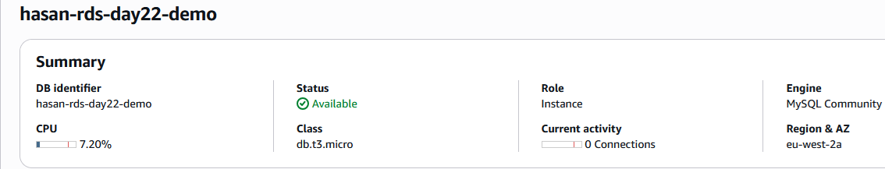
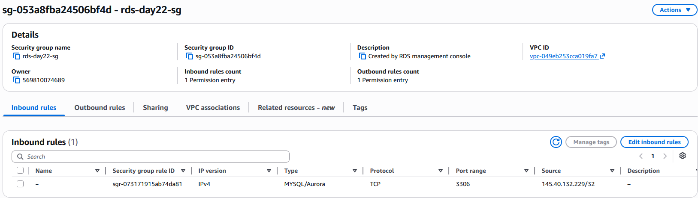
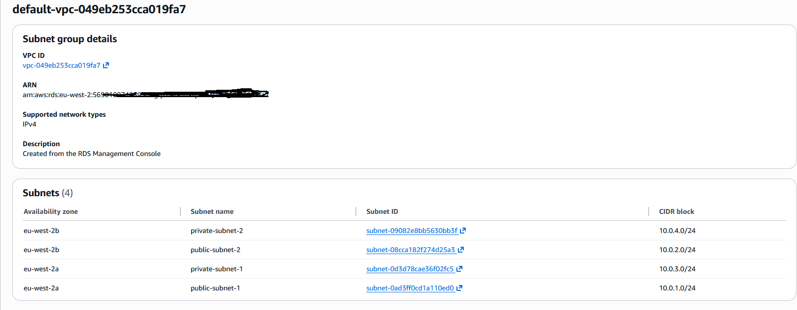

# Project 09 — SQL-to-AI Dashboard
## RDS + Python + Power BI — Cloud-Native Business Intelligence for UK SMEs

**Status:** In Progress — Foundation built Day 22 (22 May 2026)
**AWS Region:** eu-west-2 (London)
**Technologies:** Amazon RDS (MySQL), Python 3.12, boto3, mysql-connector-python, Power BI Desktop
**Portfolio site:** [https://d2ven7lubrbrhs.cloudfront.net](https://d2ven7lubrbrhs.cloudfront.net)
**GitHub:** [https://github.com/SadainHasan/cloud-ai-portfolio](https://github.com/SadainHasan/cloud-ai-portfolio)

---

## What Problem Does This Solve?

Most small UK businesses — a Leicester solicitor's firm, a halal restaurant group, a local estate agent — are drowning in data they cannot read. Their bookings live in one spreadsheet, their customer list in another, their stock in a third. Nobody in the team has the SQL knowledge to query it. Nobody has the budget for a £50,000 BI consultant.

This project demonstrates a fully cloud-native business intelligence stack that any SME can adopt: a managed relational database in AWS, a Python layer that automates data queries, and a Power BI dashboard that any non-technical manager can read and refresh with one click. The entire infrastructure runs for approximately £15-25 per month at SME scale.

As a Cloud + AI Automation Consultant, this is a service I can deliver to a client in a single day of setup. The client gets a live, refreshing dashboard. I get a repeatable, documented portfolio project that proves I can connect cloud infrastructure to business insight.

---

## What This Is

Project 09 is a three-layer business intelligence system built on AWS:

**Layer 1 — Storage (Amazon RDS MySQL):** A fully managed relational database running in a private subnet inside a custom VPC. The database holds structured business data — customer records, transactions, bookings, or inventory. RDS handles automated backups, patching, and Multi-AZ failover without any manual intervention.

**Layer 2 — Automation (Python + boto3 + mysql-connector-python):** Python scripts that connect to the RDS instance, run SQL queries, and export results to CSV or directly to Power BI's data connector. This layer can be scheduled to run automatically, delivering fresh data to the dashboard every morning without manual effort.

**Layer 3 — Visualisation (Power BI Desktop):** A three-page dashboard connected directly to the RDS database. Page 1: summary KPIs. Page 2: trend charts. Page 3: full data table with filtering. Any non-technical manager can open this dashboard and see yesterday's numbers without touching a database.

---

## Architecture

```
┌─────────────────────────────────────────────────────────────────┐
│                    my-custom-vpc (10.0.0.0/16)                  │
│                                                                 │
│  ┌─────────────────────────┐   ┌─────────────────────────────┐ │
│  │    Public Subnet        │   │    Private Subnet           │ │
│  │    (10.0.1.0/24)        │   │    (10.0.2.0/24)            │ │
│  │                         │   │                             │ │
│  │   [EC2 Bastion / App]   │──▶│   [RDS MySQL db.t3.micro]  │ │
│  │   (optional jump host)  │   │   hasan-rds-day22-demo      │ │
│  └─────────────────────────┘   │   Port: 3306                │ │
│                                │   DB: hasandb               │ │
│                                └─────────────────────────────┘ │
└─────────────────────────────────────────────────────────────────┘
         │
         │ mysql-connector-python
         ▼
┌─────────────────────┐
│   Python Script     │
│   query_rds.py      │
│   Exports → CSV     │
└─────────────────────┘
         │
         ▼
┌─────────────────────┐
│   Power BI Desktop  │
│   3-page dashboard  │
│   Auto-refresh      │
└─────────────────────┘
```

---

## Steps — Day 22 Foundation

### 1. Launch RDS Instance

Navigate: AWS Console → RDS → Create database

- Engine: MySQL 8.0
- Template: Free tier (db.t3.micro)
- Identifier: `hasan-rds-day22-demo`
- VPC: `my-custom-vpc` (your existing custom VPC from Day 8)
- Subnet group: private subnets only
- Public access: **No**
- Security group: `rds-day22-sg` (inbound port 3306 from app layer only)
- Initial DB name: `hasandb`
- Deletion protection: disabled (for learning sessions)

Wait for status: **Available** (3-5 minutes)

### 2. Note the Endpoint

Once Available, navigate to the instance details and copy the endpoint URL. It will look like:
`hasan-rds-day22-demo.abc123.eu-west-2.rds.amazonaws.com`

This endpoint is the DNS name your Python script will use to connect. Never hard-code the IP — use the endpoint so that if Multi-AZ failover occurs, your connection string remains valid.

### 3. Install Python Connector

```bash
pip install mysql-connector-python
```

### 4. Python Connection Script

```python
# connect_rds.py
# Day 22 — Test connection to Amazon RDS MySQL
# Project 09 foundation script

import mysql.connector

# Replace with your actual RDS endpoint and credentials
RDS_ENDPOINT = "hasan-rds-day22-demo.XXXXXX.eu-west-2.rds.amazonaws.com"
RDS_PORT = 3306
DB_NAME = "hasandb"
USERNAME = "admin"
PASSWORD = "YOUR_PASSWORD_HERE"  # Never commit this to GitHub

try:
    connection = mysql.connector.connect(
        host=RDS_ENDPOINT,
        port=RDS_PORT,
        database=DB_NAME,
        user=USERNAME,
        password=PASSWORD
    )
    
    if connection.is_connected():
        db_info = connection.get_server_info()
        print(f"Connected to MySQL Server version: {db_info}")
        
        cursor = connection.cursor()
        cursor.execute("SELECT DATABASE();")
        record = cursor.fetchone()
        print(f"Connected to database: {record[0]}")
        
        # Create a sample business table
        cursor.execute("""
            CREATE TABLE IF NOT EXISTS customers (
                id INT AUTO_INCREMENT PRIMARY KEY,
                name VARCHAR(100) NOT NULL,
                email VARCHAR(100),
                created_date DATE,
                total_spend DECIMAL(10,2)
            )
        """)
        print("Table 'customers' created successfully")
        
        # Insert sample data
        sample_data = [
            ("Ahmed Khan", "ahmed@example.com", "2026-01-15", 1250.00),
            ("Sarah Mitchell", "sarah@example.com", "2026-02-03", 890.50),
            ("Mohammed Ali", "mali@example.com", "2026-02-28", 3100.75),
            ("Emma Wilson", "emma@example.com", "2026-03-10", 450.00),
            ("David Patel", "david@example.com", "2026-04-01", 2200.00),
        ]
        
        cursor.executemany(
            "INSERT INTO customers (name, email, created_date, total_spend) VALUES (%s, %s, %s, %s)",
            sample_data
        )
        connection.commit()
        print(f"Inserted {cursor.rowcount} rows")
        
        # Query the data back
        cursor.execute("SELECT * FROM customers ORDER BY total_spend DESC")
        records = cursor.fetchall()
        print("\n--- Customer Data (sorted by spend) ---")
        for row in records:
            print(row)

except mysql.connector.Error as e:
    print(f"Error: {e}")
    
finally:
    if 'connection' in locals() and connection.is_connected():
        cursor.close()
        connection.close()
        print("\nRDS connection closed")
```

---

## Why This Architecture?

### Why RDS Instead of a Database on EC2?

Running MySQL on an EC2 instance gives you full control but also full responsibility: you patch the OS, manage backups, handle replication configuration, and monitor disk space manually. At Trust Bank, you would have had a DBA team for this. An SME has nobody. RDS removes every one of those tasks. The SME pays slightly more per hour but gets automated backups, Multi-AZ failover, and managed patching — equivalent to hiring a part-time DBA for a fraction of the cost.

### Why Private Subnets?

The RDS instance has no public IP address. It cannot be reached from the internet — only from resources inside the same VPC. This is how banking systems have always been architected: your core banking database was never on the public network. The same principle applies here. An SME client who migrates their customer data to RDS needs this reassurance: the database is not internet-facing.

### Why MySQL and Not Aurora?

Aurora is 5x faster than MySQL and provides 6-way replication across 3 AZs automatically, but it costs approximately 3x more than RDS MySQL. For a learning exercise and for small SME deployments (under 1,000 concurrent users), MySQL on RDS is cost-appropriate. Aurora becomes the right recommendation when the SME has high availability requirements and the budget to match. Project 09 documents both options so a client conversation can go either way.

### Why Power BI and Not QuickSight?

Amazon QuickSight is the AWS-native analytics tool. It integrates more cleanly with RDS and other AWS services. However, Power BI Desktop is free, Windows-native, and already familiar to most UK SME managers who have used Excel. The barrier to adoption is lower. For a consultant whose clients are non-technical Leicester businesses, delivering a Power BI dashboard they can open and refresh themselves is more valuable than delivering a QuickSight dashboard they'll never log into.

---

## Exam Relevance (AWS SAA-C03)

| Exam Topic | Why It Matters | Likely Scenario Question |
|---|---|---|
| RDS Multi-AZ | High availability for DB | "Company needs DB to survive AZ failure with no manual intervention — which do you choose?" → Multi-AZ RDS |
| Read Replicas | Read scaling | "Read-heavy reporting workload is slowing the primary DB — what do you recommend?" → Read Replica |
| RDS in private subnets | Security design | "DB must not be accessible from internet — how do you architect this?" → Private subnet + SG |
| Encryption with KMS | Data security | "How do you encrypt data at rest in RDS?" → Enable KMS encryption at creation |
| RDS vs DynamoDB | Service selection | "Application needs auto-scaling NoSQL with millisecond latency" → DynamoDB, not RDS |
| Snapshot restore | Recovery | "Restore DB to known state — new DNS endpoint or same?" → Always new endpoint |
| Storage scaling | Ops | "Can you reduce RDS allocated storage?" → No — can only increase |

---

## AWS Services Used

### Amazon RDS (MySQL 8.0)
- **Instance ID:** `hasan-rds-day22-demo`
- **Instance class:** db.t3.micro
- **Storage:** 20 GiB gp2 SSD
- **VPC:** my-custom-vpc (eu-west-2)
- **Subnet:** private subnets only
- **Security group:** rds-day22-sg (port 3306)
- **Cost:** ~$0.017/hour when running — **DELETE after session**

### Amazon VPC (existing)
- **VPC:** my-custom-vpc (10.0.0.0/16) — already built in Day 8
- RDS sits in private subnets, no public IP

---

## Cost

| Resource | Hourly Cost | Monthly Cost (if left running) | Action |
|---|---|---|---|
| RDS db.t3.micro | ~$0.017/hr | ~$12.50 | **DELETE after session** |
| RDS storage (20 GiB gp2) | — | ~$2.30 | Deleted with instance |
| RDS automated backup | — | Free (≤ provisioned size) | Deleted with instance |
| **Total if forgotten** | — | **~$14.80/month** | **DELETE** |

---

## Business Value

| Client Type | Pain Solved | One-Off Setup Fee | Monthly Support |
|---|---|---|---|
| Leicester solicitor (5 staff) | Client records in spreadsheets, no reporting | £350–500 | £50/month |
| Halal restaurant group (3 sites) | Sales data siloed per location | £400–600 | £75/month |
| Local estate agent | Property pipeline not queryable | £300–450 | £50/month |
| Small manufacturing firm | Inventory and orders in Excel | £500–750 | £100/month |

Note: All values shown are post-ILR consulting rates (after 13 October 2027). No client work before ILR is granted.

---

## Screenshots





